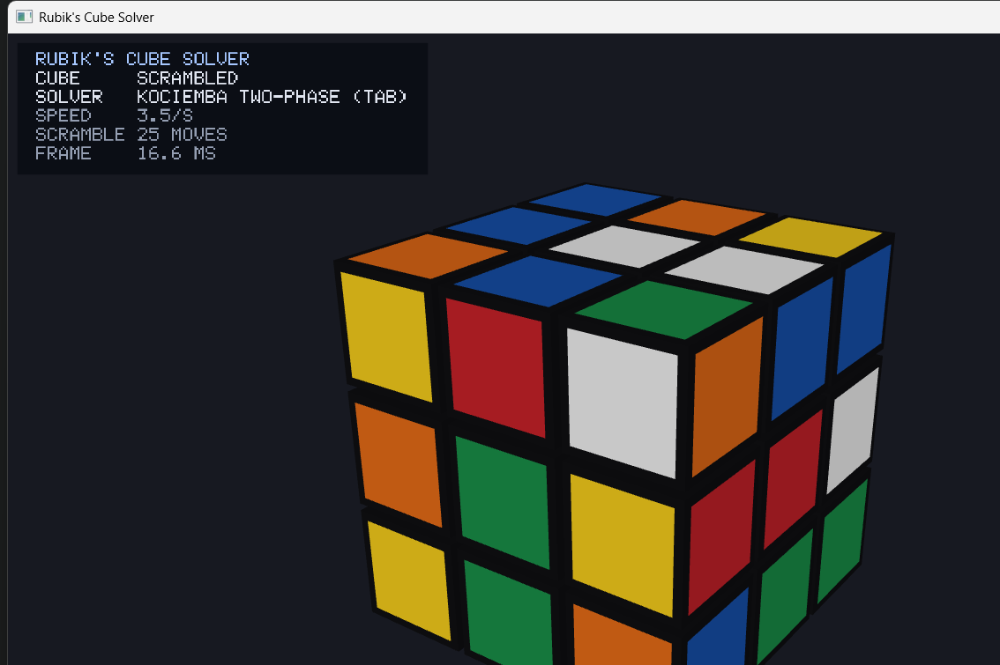
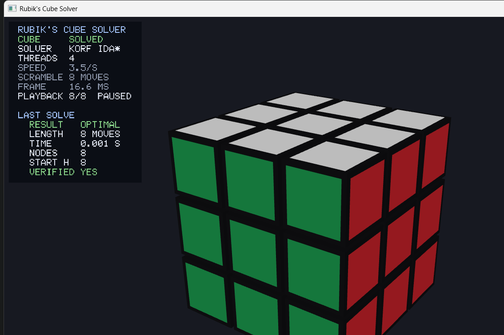
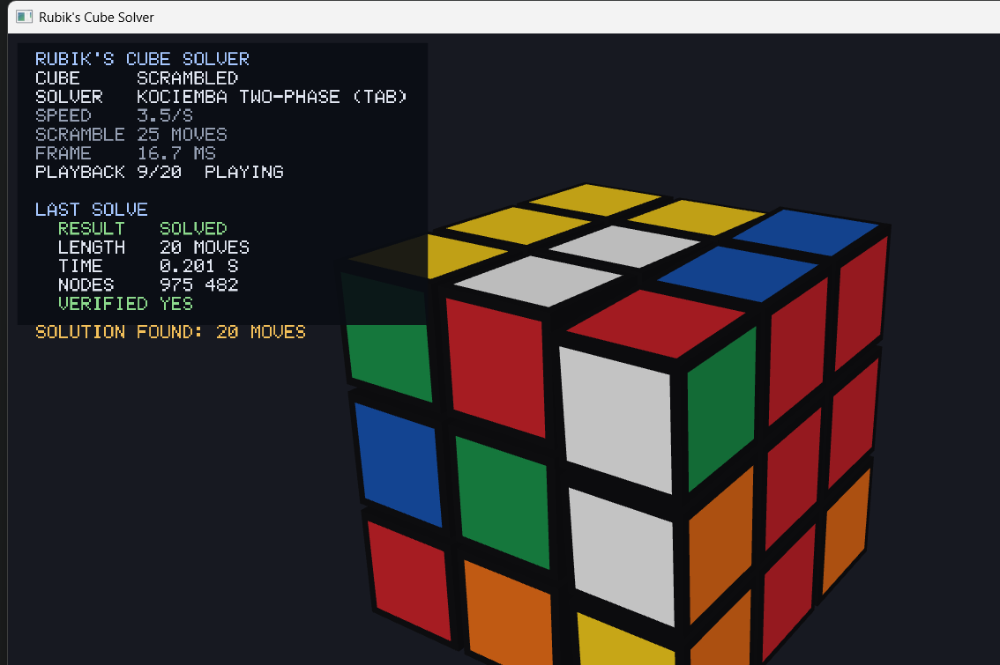
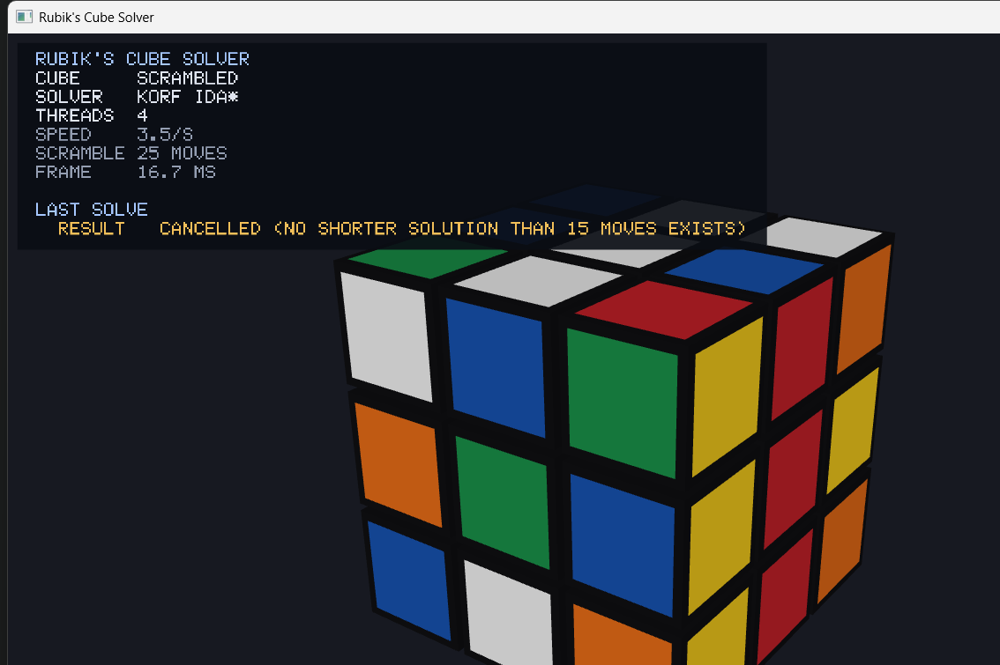
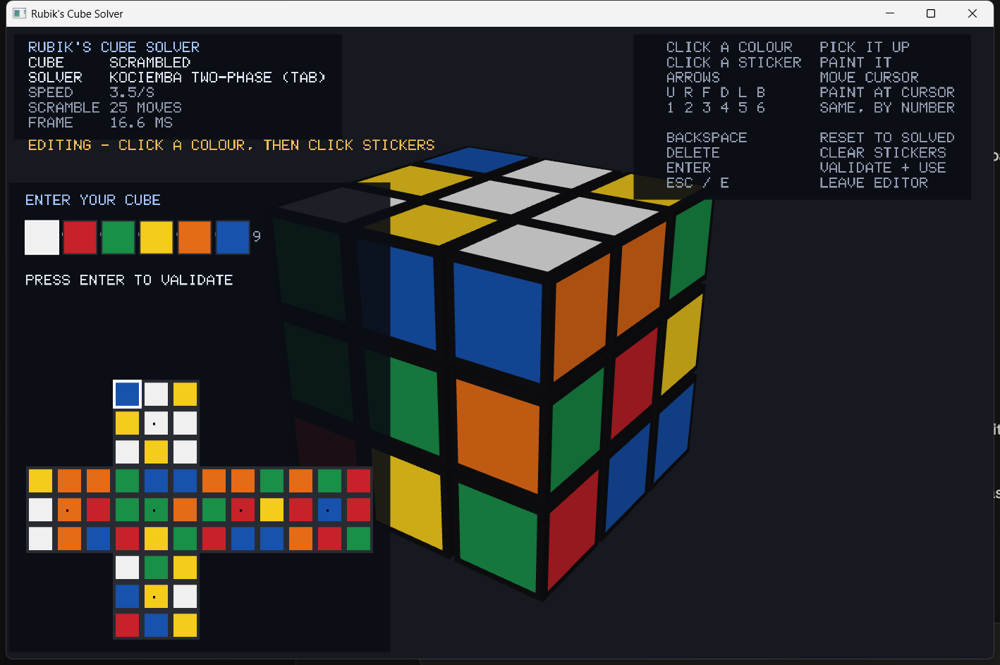

# Rubik's Cube Solver

A Rubik's Cube solver and 3D visualiser in modern C++.

> **Status: feature-complete and audited.** The cube core, coordinates, move
> tables, both solvers, the Korf pattern databases, the benchmark/profiling
> harness, the stronger heuristic, root-parallel multithreading, the OpenGL
> viewer and the **interactive cube editor** are all done. **318 tests pass in
> Debug, Release and RelWithDebInfo, and under AddressSanitizer.** Every number in this file was measured on the machine
> described under *Methodology*; none is estimated or illustrative, and where a
> measurement could not be made honestly it is named as such under
> [Limitations](#limitations).

---

## Quick start

Windows, 64-bit. You need [CMake](https://cmake.org/download/) 3.20+ and a C++17
compiler (Visual Studio 2022 or its Build Tools). Nothing else — GLFW, GLM, GLEW
and GoogleTest are fetched automatically on the first configure.

```bash
cmake -S . -B build -G "Visual Studio 17 2022" -A x64
```

```bash
cmake --build build --config Release --parallel
```

```bash
build\bin\Release\rubiks_solver.exe --generate-pdb
```

```bash
build\bin\Release\rubiks_gui.exe
```

The third step builds the pattern databases the optimal solver needs. It takes
about a minute and writes ~83 MB into `data/`. Skip it if you like — the viewer
and the fast solver work without it and will tell you the optimal solver is
unavailable rather than failing.

Add `--with-7edge` to that step for the stronger heuristic (another 244 MB and
about four minutes). The databases are generated, not shipped, which is why this
repository is a megabyte rather than a third of a gigabyte.

> **64-bit is required.** The databases exceed the address space a 32-bit
> process gets; the configure step fails with an explicit message rather than
> letting you find out at run time.

Then press `Space` to scramble and `Enter` to solve, or `E` to type in the
colours of a real cube. Full controls are under
[The 3D viewer](#controls); the command-line tools are under [Usage](#usage).

---

## Overview

The project has two halves that are deliberately kept apart:

* a **headless core and solver**, which can be built, tested and benchmarked
  with no graphics context at all, and
* a **3D front end** that renders the cube, animates turns and plays solutions
  back -- and which the solver knows nothing about.

You can either watch it solve a generated scramble, or type in the colours of a
real cube and get an algorithm for it. See
[Solve your own cube](#solve-your-own-cube).

The solver targets *optimal* solutions using IDA\* with pattern-database
heuristics (Korf's algorithm), backed by a fast two-phase solver (Kociemba) for
interactive use.

## Features

| | |
|---|---|
| **Cube core** | 40-byte cubie state, in-place make/unmake, structural validation, deterministic scrambles, facelet conversion in both directions |
| **Kociemba two-phase solver** | ~20 moves in ~200 ms; keeps improving while a budget remains |
| **Korf IDA\*** | Provably shortest solutions, with pattern-database heuristics and an explicit admissibility argument |
| **Pattern databases** | Corner (8! × 3⁷) plus two 6-edge databases, and an optional 7-edge database; nibble-packed, checksummed, generated in-process |
| **Multithreading** | Root-parallel IDA\* at 1–8 threads, sharing one read-only copy of the databases |
| **3D viewer** | OpenGL 3.3, quaternion orbit camera, animated turns, background solving, solution playback |
| **Cube editor** | Enter a real cube on a 2D net; the state is validated against every physical constraint before any solver sees it |
| **CLI** | Scramble, apply, load from stickers, solve, solve optimally, generate databases, print a net |
| **Benchmark harness** | Eight deterministic suites, CSV output, machine fingerprint |
| **Tests** | 318 GoogleTest cases, passing in Debug, Release and RelWithDebInfo, and under AddressSanitizer |

---

## Why two solvers

An optimal solver and an interactive solver are different problems.

Finding a provably shortest solution is expensive. The reference implementation
this project studied ([benbotto/rubiks-cube-cracker][ref]) reports measured
solve times between **0.6 and 24.5 hours** for individual hard scrambles. That
is the honest cost of optimality, and no amount of tuning changes the order of
magnitude.

That is unusable for a GUI that wants to animate a solution on a keypress, and
it makes a benchmark sweep across scramble depths impossible to actually run.
So the project ships both:

| Solver | Purpose | Solution length | Speed |
|---|---|---|---|
| **Korf IDA\*** (done) | Provably optimal; the algorithmic centrepiece | always minimal | 55 ms at length 12, 11 s at 14 |
| **Kociemba two-phase** (done) | Interactive use, GUI animation, full-depth benchmarks | 20.2 moves mean, measured | 6 ms for a first answer |

The fast solver is Kociemba rather than the reference project's Thistlethwaite.
See [Design decisions](#design-decisions) for the comparison behind that.

Note also that **God's number is 20**: every cube state is solvable in at most
20 face turns. A "30-move scramble" is not deeper than a 20-move one — it is
just a random state. Benchmarks therefore report the *optimal solution length*
of each state, not the length of the scramble that produced it.

[ref]: https://github.com/benbotto/rubiks-cube-cracker

---

## Architecture

```
                        ┌──────────────┐
                        │  Cube core   │  Move, Cube, Facelets, Error
                        │  (40 bytes)  │  no dependencies at all
                        └──────┬───────┘
                               │
            ┌──────────────────┼───────────────────┐
            │                  │                   │
     ┌──────▼──────┐   ┌───────▼────────┐   ┌──────▼───────┐
     │ Coordinates │   │    Kociemba    │   │   ui layer   │
     │ Move tables │──▶│   two-phase    │   │ CubeLayout   │
     └──────┬──────┘   │  + pruning     │   │ CubeController│
            │          └───────┬────────┘   │ SolverService│
     ┌──────▼──────────┐       │            └──┬────────┬──┘
     │ Pattern         │       │               │        │
     │ databases       │       │               │        │
     │ corner / 6A /   │       │               │        │
     │ 6B / opt. 7     │       │               │        │
     └──────┬──────────┘       │               │        │
            │                  │               │        │
     ┌──────▼──────────┐       │               │        │
     │  Korf IDA*      │◀──────┼───────────────┘        │
     │  + heuristic    │       │   background solve     │
     └──────┬──────────┘       │                        │
            │                  │                 ┌──────▼────────┐
     ┌──────▼──────────┐       │                 │    render     │
     │ Root-parallel   │       │                 │ GlContext     │
     │ search (1-8)    │       │                 │ Shader / Mesh │
     └─────────────────┘       │                 │ Camera        │
                               │                 │ CubeGeometry  │
            ┌──────────────────┴───┐             │ CubeRenderer  │
            │        CLI           │             │ TextOverlay   │
            │ rubiks_solver        │             └───────┬───────┘
            │ rubiks_bench         │                     │
            └──────────────────────┘             ┌───────▼───────┐
                                                 │  rubiks_gui   │
                                                 └───────────────┘
```

Read top-down: everything depends on the cube core, nothing depends on the
renderer. The two solvers share the coordinate machinery but neither knows about
the other. `ui` sits between the viewer and the solvers and contains no
graphics, which is why the animation, playback and background-solving logic is
unit-testable without a window. `rubiks_solver` and `rubiks_bench` link nothing
below the `render` box — verifiably so: neither imports a single graphics DLL.

### Source layout

```
src/
  core/          Cube representation and move algebra. No dependencies.
    Move.h/.cpp      The 18 face turns, parsing, notation, pruning rules
    Cube.h/.cpp      Cubie-level state, move application, validation
    Facelets.h/.cpp  Sticker view: rendering, parsing, legality checking
    CubeValidation.* Sticker entry -> verdict + Cube, as data not exceptions
    Error.h          Exception hierarchy, including the cube fault codes
  solver/        Search and heuristics
    Combinatorics.h  Generic ranking: permutations, orientations, combinations
    Coordinate.h/.cpp  Cube state projected onto dense integer ranges
    MoveTable.h/.cpp   Precomputed coordinate transitions
    PruningTable.h     Exact distances for the two-phase solver
    TwoPhaseSolver.*   Kociemba two-phase search
    PatternDatabase.h  Generation, storage and I/O for Korf databases
    NibbleArray.h / ByteArray.h   The two storage layouts, benchmarked
    korf/
      CornerAbstraction.h  8 corners: permutation and twist
      EdgeAbstraction.h    6 chosen edges: position and flip
      KorfHeuristic.h      max of the three databases
      OptimalSolver.*      IDA* over the full cube
  ui/            Application layer. Knows the cube; knows no graphics.
    CubeLayout.h/.cpp     Grid slots, facelet mapping, layer rotations
    CubeEditor.h/.cpp     The 2D net: 54 editable stickers and its geometry
    CubeController.*      Logical cube, move queue, animation clock, playback
    SolverService.*       Solving on a worker thread, cancellable
  render/        OpenGL. The only part of the project that knows graphics exists.
    Gl.h                  GLEW-before-GLFW include order, in one place
    GlContext.h/.cpp      RAII window, 3.3 core context, loader
    Shader.h/.cpp         RAII program with cached uniform locations
    Mesh.h/.cpp           RAII vertex array and buffer
    Camera.h/.cpp         Quaternion orbit camera
    CubeGeometry.*        The one cubie mesh all 27 are drawn from
    CubeRenderer.*        Draws a Cube plus a layer rotation
    TextOverlay.*         Batched HUD text from a built-in bitmap font
  app/
    cli_main.cpp     Command-line front end
    bench_main.cpp   The rubiks_bench executable
    gui_main.cpp     The viewer: input, camera, state machine, HUD
  bench/
    Benchmark.h/.cpp    Case sets, configurations, records, CSV output
    Microbench.h/.cpp   Differential timing of every hot-loop primitive
    HeuristicAnalysis.* Distribution of each heuristic over random states
    ProcessMemory.*     The only platform-specific code, isolated here
tests/           GoogleTest suite
  TestDatabases.h  Shared access to the generated databases, so the binary
                   loads them at most twice rather than once per test file
data/            Generated pattern databases (not in version control)
bench-results/   Committed benchmark runs, CSV and text
docs/screenshots/  Viewer screenshots used in this README
```

The dependency direction is strictly one-way: `core` knows nothing about
`solver`, neither knows anything about `ui`, and none of the three knows
anything about `render`. This is what lets the solver be benchmarked headlessly
and tested without a window -- and it is visible in the linked binaries, where
`rubiks_solver` imports no graphics library at all. See
[The 3D viewer](#the-3d-viewer).

---

## Cube representation

The cube is stored in **cubie form**: four parallel arrays totalling 40 bytes.

```cpp
std::array<std::uint8_t, 8>  cp_;  // which corner cubie sits in each corner slot
std::array<std::uint8_t, 8>  co_;  // its twist, 0..2
std::array<std::uint8_t, 12> ep_;  // which edge cubie sits in each edge slot
std::array<std::uint8_t, 12> eo_;  // its flip, 0..1
```

**Why not a 54-character sticker string.** Three reasons:

1. A face turn touches only 4 corners and 4 edges. `apply()` is two 4-cycles
   over 40 bytes that stay entirely in L1 cache — versus permuting 20 of 54
   characters.
2. Pattern-database indexing needs permutation and orientation as numbers.
   From cubie form the index is a direct computation; from stickers you would
   have to reconstruct the cubies first, on every single node.
3. Both make *and* unmake are O(1) and allocation-free, which is what allows
   IDA\* to mutate one cube in place instead of copying a state per node.

The cubie numbering follows the standard Kociemba convention. The UD-slice
edges (FR, FL, BL, BR) deliberately occupy indices 8–11 so that they are
contiguous, which makes the Kociemba phase-2 coordinates cheap to compute.

### Move encoding

The 18 moves are laid out three-per-face as `{90° CW, 180°, 90° CCW}`, which
makes three useful properties fall out of integer arithmetic rather than a
lookup table:

```cpp
face(m)  == m / 3          // U R F D L B
turns(m) == m % 3          // 0 = 90 CW, 1 = 180, 2 = 90 CCW
axis(m)  == face(m) % 3    // U/D -> 0, R/L -> 1, F/B -> 2
```

### Move pruning

Two rules cut the branching factor from 18 to **13.5**:

1. Never turn the same face twice in a row (`R R'` is a no-op, `R R` is `R2`).
2. Opposite faces commute, so allow only one order of each commuting pair —
   `U` then `D` is searched, `D` then `U` is not.

Over a depth-18 search that is the difference between `18^18 ≈ 4×10^22` and
`13.5^18 ≈ 4×10^20` nodes — two orders of magnitude before the heuristic even
gets involved.

### State validation

`Cube::validate()` checks the three invariants that every legally reachable
state satisfies, and reports which one failed:

| Invariant | Violated by |
|---|---|
| Corner twists sum to 0 (mod 3) | A single twisted corner |
| Edge flips sum to 0 (mod 2) | A single flipped edge |
| Corner and edge permutation parity agree | A single swapped pair |

Together with a bijection check on both permutations, this rejects exactly the
states that cannot be produced by any sequence of face turns — which is the
difference between "the solver is slow" and "the solver will never terminate".

---

## Coordinates and move tables

A **coordinate** projects one aspect of the cube onto a dense integer range.
`cornerOrientation`, for instance, maps the eight corner twists onto
`[0, 2187)` -- 3^7 rather than 3^8, because the eighth twist is forced by the
invariant that they sum to zero mod 3.

Two things follow, and they are the entire reason coordinates exist:

1. **A move becomes a table lookup.** A coordinate's new value after a move
   depends only on its old value and the move, never on the parts of the cube
   the coordinate ignores. So the puzzle's whole dynamics, as seen by that
   coordinate, precomputes into a flat array. Applying a move in the search
   becomes one load instead of permuting 40 bytes.
2. **A heuristic becomes an array index.** A pattern database is just an array
   indexed by a coordinate.

| Coordinate | Range | Meaning | Moves |
|---|---:|---|---|
| `cornerOrientation` | 2,187 | corner twists (3^7) | all 18 |
| `edgeOrientation` | 2,048 | edge flips (2^11) | all 18 |
| `udSlice` | 495 | which slots hold the slice edges, C(12,4) | derived |
| `udSliceSorted` | 11,880 | ...and in what order, 12P4 | all 18 |
| `cornerPermutation` | 40,320 | 8! | all 18 |
| `udEdgePermutation` | 40,320 | 8!, the non-slice edges | G1 only |
| `slicePermutation` | 24 | 4! | G1 only |

The last two are only defined inside **G1** = `<U, D, R2, L2, F2, B2>`, the
subgroup where every edge is oriented, every corner twisted correctly, and the
four slice edges are somewhere in the slice. Outside G1 a U/D edge can sit in a
slice slot and the permutation is meaningless, so those tables are built for the
ten G1 moves only and their other entries are marked invalid.

The layout deliberately makes `udSlice == udSliceSorted / 24` hold for every
state, so phase 1 can track only the sorted coordinate and still index a pruning
table keyed on the unsorted one. Inside G1, `slicePermutation == udSliceSorted %
24` likewise falls out for free.

**Measured**: all six tables build in **65-108 ms** and occupy **3.32 MB**
(MSVC Release `/O2`, i5-1135G7). Storage is row-major by coordinate so the 18
successors of one state are contiguous -- 36 bytes, comfortably inside a cache
line, matching how the search reads them.

### Reuse

This machinery is built once and serves both solvers. Korf's corner pattern
database index is exactly

```
cornerOrientation(cube) * 40320 + cornerPermutation(cube)
```

giving the 2187 x 40320 = **88,179,840** states his paper describes -- the same
two functions Kociemba needs. The edge databases will use the same generic
partial-permutation ranking (`encodePartialPermutation`), which is already
implemented and tested at 12P4 and 12P6.

The permutation encoder uses the **linear** Lehmer-code variant: rather than
rescanning the prefix to count smaller values (quadratic), it keeps a bitmask of
consumed values and gets the count with a single popcount. Korf highlights this
in his large-scale BFS paper, and the reference project attributes most of its
speed advantage over comparable solvers to exactly this choice.

---

## The two-phase solver

Kociemba's algorithm splits the problem at a subgroup.

**Phase 1** drives the cube into **G1 = `<U, D, R2, L2, F2, B2>`** -- every edge
oriented, every corner twisted correctly, and the four slice edges somewhere in
the slice. Those three conditions are exactly what the ten G1 moves preserve, so
the subgroup and its generators characterise each other. **Phase 2** then
finishes the cube using only those ten moves.

The payoff is that each phase searches a far smaller space than the whole cube,
and each is guided by exact pruning tables over its own coordinates.

### Pruning tables

Each phase takes the **maximum** of two tables. Taking the max of admissible
heuristics is itself admissible: if neither ever overestimates, neither does the
larger. Note they are *not* additive -- both phase-1 tables count the same moves,
so summing them would break admissibility. (Disjoint pattern databases can be
added; these overlap.)

| Table | Coordinates | Entries | Max distance (measured) |
|---|---|---:|---:|
| `flipSlice` | edge orientation x slice | 1,013,760 | 9 |
| `twistSlice` | corner orientation x slice | 1,082,565 | 9 |
| `cornerSlice` | corner perm x slice perm | 967,680 | 14 |
| `edgeSlice` | UD-edge perm x slice perm | 967,680 | 12 |

All four are generated by breadth-first search backwards from the goal. That is
only valid because every move set here is **closed under inversion** -- `{U, U2,
U'}` contains each element's inverse and `R2` is its own -- so distance *from*
the goal equals distance *to* it. Generation asserts that BFS reaches every
index; an unreachable state would mean the coordinate space and move set
disagree.

Entries are bytes, not nibbles. All four maxima fit in a nibble, so packing would
halve the footprint -- but the measurement comes first, and 4 MB is not currently
a problem. (For the Korf databases packing is not optional: it is the difference
between 42 MB and 84 MB.)

**Measured**: move tables and pruning tables together are **7.18 MB** and build
in **~0.4 s**.

### Why the first solution is not the answer

The algorithm's defining weakness: a *quick* route into G1 often leaves a state
that phase 2 solves slowly. So the search does not stop at its first answer. It
keeps enumerating longer phase-1 solutions, each of which may admit a shorter
phase 2, and keeps the best total.

The smallest case that shows this is a cube scrambled by a single `R`. The first
phase-1 solution reached is `R` itself -- that lands in the R2 state, which is
already in G1 -- but phase 2 may not then open with `R2`, since two turns of the
same face across the boundary are redundant. It is forced into a long detour.
Only by continuing does the search reach the phase-1 solution `R'`, whose phase 2
is empty. There is a test named for exactly this
(`FirstSolutionIsNotNecessarilyTheShortest`).

This is why the solver takes a time budget, and why it is **not** an optimal
solver. That is Korf's job.

### Search details

- **Move pruning** reuses the core's `isRedundant`, inside each phase *and*
  across the phase boundary -- phase 2 is told the last phase-1 move so it never
  opens with a turn of the same face.
- **Phase-1 solutions ending in a G1 move are discarded.** G1 is closed under its
  own generators, so such a prefix was already in G1 and was enumerated one depth
  earlier, with that move still available to phase 2. Keeping them duplicates
  work.
- **Depth-bounded iteration**: phase 1 runs at exactly depth *d*, starting from
  the heuristic's lower bound and increasing. The loop stops once *d* reaches the
  best solution length, since no longer phase 1 could improve on it.
- **Solution verification** is not left to the search. Both the CLI and the tests
  apply the generated moves to the original cube and check `isSolved()`.

### A deliberate simplification

At the phase-1/phase-2 boundary the solver **replays the phase-1 moves onto a
copy of the cube** and reads the phase-2 coordinates directly.

The reference implementation instead threads extra coordinates through phase 1 so
the transition needs no replay. That is faster per phase-1 solution, but it costs
two more coordinate families and their move tables purely to serve the handover.
Replaying is at most 12 cube moves against a phase-2 search that expands
thousands of nodes, so the simpler version wins on maintainability at no
measurable cost. An `assert(isInG1(cube))` at the boundary makes the invariant
explicit.

## Pattern databases

A pattern database stores the *exact* solution length for an **abstraction** of
the cube -- a version of the puzzle with some pieces rubbed out. Solving the
abstraction is easy enough to enumerate completely, and its answer bounds the
real one from below.

### Why the values are admissible

This is worth spelling out, because "it came from a pattern database" is not an
argument.

An abstraction is a map `phi` from cube states to abstract states that forgets
information. The corner database keeps only the eight corner cubies (permutation
and twist) and discards every edge; an edge database keeps six chosen edges
(position among the twelve slots, and flip) and discards the corners and the
other six. Two properties make each a genuine *relaxation*:

1. **It is a homomorphism.** For every face turn `m`, `phi(apply(s, m))` depends
   only on `phi(s)` and `m` -- never on what `phi` threw away. This is exactly
   what makes the transition well defined, and it is the single most important
   thing the tests check (`SuccessorsMatchApplyingTheMove`, for both
   abstractions, against real scrambled cubes).
2. **It preserves the goal.** `phi(solved)` is the abstract goal.

From those two: take any real solution for a state `s`, of length `L`. Applying
that same sequence in the abstract space carries `phi(s)` to `phi(solved)` in `L`
moves. So an abstract solution of length `L` exists, and the *shortest* abstract
solution is therefore at most `L`. The database stores exactly that shortest
distance, computed by breadth-first search. Hence

```
PDB value  <=  true distance
```

for every state. Discarding constraints can only make a problem easier.

### Why max and not sum

Summing admissible heuristics is valid only when no single move is counted
twice -- the condition behind Korf and Felner's *additive* pattern databases. It
does not hold here. One face turn moves four corners **and** four edges at once,
and those edges may be drawn from both edge groups, so a single move can be
counted by all three databases simultaneously. Adding them could overestimate
and would destroy admissibility.

`max` is always safe: if no individual value exceeds the true distance, neither
does the largest. That is what Korf's 1997 paper uses, and what this
implementation uses.

### Configuration, and why not the reference's

The reference project uses a much larger set. Both were sized against this
machine's 7.75 GB:

| | Reference | **This project** |
|---|---|---|
| Corner | 8!·3⁷ = 88,179,840 (42 MB) | same |
| Edge groups | 2 x **7** edges, 12P7·2⁷ = 510,935,040 (244 MB each) | 2 x **6** edges, 12P6·2⁶ = 42,577,920 (**20.3 MB** each) |
| Edge permutation | 12! = 479,001,600 (228 MB) | not used |
| **Total on disk** | ~758 MB | **82.65 MB** |
| **Resident** | ~1.5 GB (it expands nibbles to bytes) | **82.65 MB** |
| Generation | "the better part of a day", ~5 GB peak | **48.6 s, 50 MB peak** |

The 6-edge split is Korf's own paper configuration. It was chosen deliberately
over the larger one: it fits comfortably, generates in under a minute, and the
abstraction machinery is parameterised so a 7-edge variant is a constant change
(`kTrackedEdges`) rather than a rewrite.

### Generation

Breadth-first search outward from the goal, **frontier-less**: rather than
keeping a queue of states to expand, each pass sweeps the distance array itself
for entries at the current depth. Peak memory is therefore just the array. That
is the whole reason this generates in 50 MB where the reference needs ~5 GB --
its `BreadthFirstCubeSearcher` keeps a `queue<shared_ptr<Node>>` in which every
node holds a parent pointer, so the entire explored tree stays alive.

Generation is deterministic (BFS order is fixed, no randomness), and
`checksum()` makes that checkable. It throws if BFS fails to reach every index,
since a gap would mean the index space and the transition function disagree and
would silently yield a wrong heuristic.

**Measured**, MSVC Release `/O2`, i5-1135G7:

| Database | States | Time | Max distance | On disk |
|---|---:|---:|---:|---:|
| corner | 88,179,840 | **8.71 s** | **11** | 44,089,958 B |
| edgeA | 42,577,920 | 20.51 s | **10** | 21,288,998 B |
| edgeB | 42,577,920 | 19.37 s | **10** | 21,288,998 B |
| **total** | | **48.6 s** | | **82.65 MB** |

Both maxima match Korf's published figures. Note the corner database generates
*faster* despite being twice the size: its successors are two move-table lookups
(orientation and permutation transition independently), whereas an edge
successor needs a decode, a slot remap and a re-rank.

Peak working set during generation was **50.1 MB**; loading all three from disk
takes **0.25 s**.

### Storage: nibble packing, measured

Every distance is at most 11, so entries fit in 4 bits. Whether packing actually
helps is a question about cache behaviour, not instruction count, so it was
measured rather than assumed -- 5,000,000 random lookups into the corner
database:

| Storage | Size | Total | Per lookup |
|---|---:|---:|---:|
| **Nibble** | 42.05 MB | **71.3 ms** | **14.3 ns** |
| Byte | 84.09 MB | 93.1 ms | 18.6 ns |

Nibble packing is both **half the size and 23% faster**. Random access over
42 MB is cache-miss bound, and halving the footprint more than pays for the
shift and mask. Both layouts are kept (`NibbleArray`, `ByteArray`) behind the
same interface so the comparison stays reproducible; a test asserts they produce
identical distances.

**Memory mapping was considered and not implemented.** Its benefits -- lazy
paging, sharing between processes, eviction under pressure -- matter for the
reference's 758 MB set. At 82.65 MB with random access across the whole array,
the pages all end up resident anyway, so mmap would add Windows-specific
`CreateFileMapping` code for no measurable gain. Worth revisiting only if the
7-edge configuration is adopted.

### How much does it actually help?

A depth-bounded DFS (one IDA\* iteration) from scrambles of the same depth, with
move pruning enabled in every case so the comparison isolates the heuristic.
Average nodes expanded over 5 samples:

| Depth | No heuristic | Corner PDB | Max of 3 PDBs |
|---:|---:|---:|---:|
| 5 | 376,417 | 164 | **38** |
| 6 | 4,965,017 | 300 | **45** |
| 7 | 36,213,887 | 4,432 | **56** |
| 8 | (too slow) | 3,849 | **88** |

At depth 7 the corner database alone cuts the tree **8,000-fold**, and all three
together **647,000-fold**.

The interesting part: the *mean* heuristic value over random states is 8.89 for
max-of-three against 8.76 for corners alone -- barely different. Yet the search
impact is a further 79x. Pruning is exponential in the heuristic, so a tenth of a
move in the mean compounds enormously over a tree. That is also the argument for
the reference's larger databases, and the reason its 7-edge set is worth the
memory if you have it.

The distribution of the combined estimate over 200,000 random states:

| Estimate | 6 | 7 | 8 | 9 | 10 | 11 |
|---|---:|---:|---:|---:|---:|---:|
| Share | 0.01% | 1.12% | 26.1% | **55.5%** | 17.2% | 0.08% |

Mean 8.89. A random cube needs about 18 moves, so this heuristic guides only the
first half of the search well -- which is precisely why an optimal solve takes
hours, and why the two-phase solver exists alongside it.

### Generating them

```bash
rubiks_solver --generate-pdb
rubiks_solver --scramble 25 --heuristic
```

The files land in `./data` (override with `--data-dir`) and are not in version
control. `loadOrGenerate` builds whatever is missing. Files carry a magic
string, a format version, a state count, an entries-per-byte marker and an
FNV-1a checksum; a truncated or corrupted file is rejected rather than trusted,
and a byte-packed file cannot be read as nibble-packed.

## The optimal solver

Korf's algorithm: IDA\* over the full cube, guided by the pattern databases.

### Why IDA\* and not A\* or BFS

The cube has 4.3 x 10^19 states and solutions run to 20 moves. A\* or
breadth-first search would have to hold the frontier in memory, which at that
depth is beyond any machine that will ever exist. IDA\* keeps only the current
path -- **O(d) memory, about 20 moves** -- and pays for it by re-expanding the
shallow part of the tree once per threshold.

That re-expansion sounds wasteful and is not. The tree grows geometrically with
an effective branching factor of 13.35, so all earlier iterations together cost
only about `b/(b-1)` ~ 1.08 times the final one. Measured node counts per
iteration show it directly. A length-12 solve starting from an initial heuristic
of 9 expands, per threshold:

```
5  →  108  →  1,620  →  2,258        (3,991 total)
```

Every wasted iteration together costs less than the one that finds the answer.
Trading that overhead for bounded memory is what makes the problem tractable at
all.

### Structure

One mutable cube, mutated in place by **make/unmake**, and one reusable move
stack. No cube copy, no heap allocation, no container built during expansion.

This is the main departure from the reference implementation, which pushes full
cube copies onto an explicit `stack<Node>` and allocates a `priority_queue` per
expansion whose entries *each* hold another cube copy -- roughly 18 cube copies
plus an allocation at every node. It also dispatches every move virtually
through a `RubiksCube` base class. Our `Cube` is concrete, `apply`/`undo` are a
pair of 4-cycles over 40 bytes, and `isRedundant` is integer arithmetic rather
than a chain of comparisons.

A debug assertion checks that the cube returns to the root state after each
completed iteration, which is the invariant that make/unmake must satisfy.

### Thresholds

The bound starts at the root heuristic and advances to the smallest `f = g + h`
seen among pruned nodes, rather than simply incrementing. With an integer
heuristic that is usually `bound + 1`, but it can jump and skip a fruitless
iteration.

The bound-aware lookup (`estimateAtLeast`) stops querying databases as soon as
one already exceeds the remaining budget. This gives *exactly* the same pruning
decisions as computing the full maximum -- it exits early only when it can
already prove the bound is exceeded -- while skipping one or two cache misses.

### Move ordering: measured, then switched off

The reference orders successors by estimated distance. We implemented it,
measured it, and left it **off by default**.

| Optimal length | plain: nodes | plain: ms | ordered: nodes | ordered: ms |
|---:|---:|---:|---:|---:|
| 11 | 1,696 | **10.4** | 1,501 | 14.9 |
| 12 | 15,241 | **95.7** | 11,611 | 125.5 |

Ordering genuinely expands fewer nodes -- 24% fewer at length 12 -- and is still
**slower in wall-clock terms**. It has to compute the *full* heuristic for every
child, forfeiting the early exit, and then apply each surviving move a second
time. The gap widens with depth: at length 14 the plain search averages 11.3 s
where the ordered one averaged 23.5 s.

Fewer nodes is not the goal; less time is. This is exactly the kind of
assumption that only measurement settles, and it is kept configurable
(`--order-moves`) so the comparison stays reproducible.

### Optimality, and how it is checked

IDA\* returns a shortest solution provided the heuristic never overestimates.
Given admissibility, a node pruned because `g + h > bound` cannot lie on any
solution of length `<= bound`, so an iteration that completes without success
*proves* no solution of that length exists.

Since a claim of optimality is only as good as its evidence, and since the
two-phase solver cannot serve as an oracle (it is not optimal), correctness is
established four independent ways:

1. **Against breadth-first search.** A BFS over the real cube builds the exact
   distance of all ~620,000 states within five moves, using no pattern database
   and no IDA\* machinery. Every state within **three** moves is checked
   exhaustively (all 3,502 of them), and 1,500 sampled states across the full
   table must match exactly.
2. **By brute force.** For solved states up to length 7, an unguided exhaustive
   DFS re-searches every *shorter* length. If any succeeded, the answer was not
   optimal.
3. **By construction.** All 18 single-move states and all 243 canonical
   two-move states must return exactly 1 and 2.
4. **By agreement between heuristics.** A weaker heuristic explores far more but
   must reach the same answer; uninformed, corner-only and max-of-three are
   compared on the same states. Move ordering is likewise checked not to change
   the result.

Every solution is additionally applied to the original cube and verified solved.

### Timeouts never claim optimality

IDA\* has no "best so far": it either proves a threshold or does not. A timed-out
search therefore returns **no solution at all** and reports
`OptimalOutcome::TimedOut`; only `Optimal` licenses the claim. What it *can*
still report is a sound **lower bound**, since every completed iteration rules
out its own threshold:

```
Outcome:            timed out
Optimality:         NOT ESTABLISHED
Proven lower bound: 13 moves (no shorter solution exists)
```

`DepthLimitReached` is reported distinctly from `TimedOut`.

### Why the heuristic averages 8.89 when states need 18

This is the question the heuristic study set out to answer, and the answer is structural
rather than a tuning problem.

**Every pattern database has a hard maximum**, because every abstract state is
solvable within it: 11 moves for the corner database, 10 for each six-edge
database, 11 for the seven-edge one. A `max` combination cannot exceed the
largest of those, so

```
h  <=  11,  always
```

while a random cube needs about 18 moves. The heuristic is not merely weak in
the average case -- it is *incapable* of exceeding 11, which means roughly seven
levels of every deep search run essentially unguided. That is the entire reason
optimal length 14 is the practical ceiling, and no database within this memory
budget changes it.

Measured over 200,000 random states (`bench-results/phase9-heuristics.txt`):

| Heuristic | mean | median | min | max |
|---|---:|---:|---:|---:|
| corner | 8.766 | 9 | 3 | 11 |
| edge 6-A | 7.616 | 8 | 3 | 10 |
| edge 6-B | 7.625 | 8 | 2 | 9 |
| **edge 7** | **8.458** | 9 | 4 | 10 |
| max of three (was default) | 8.893 | 9 | 6 | 11 |
| max of four (+7-edge) | 9.058 | 9 | 6 | 11 |
| max of four + inverse | **9.135** | 9 | 6 | 11 |

Note what the seven-edge database does and does not do. On its own it is much
stronger than a six-edge one (8.458 against 7.62), but adding it to the maximum
lifts the combination only from 8.893 to 9.058 -- because the corner database
already dominates most states. The gain is real but small in the mean, and the
ceiling does not move at all.

On the standard case set, where the true optimal distance is known, correlation
with true distance rises from 0.835 to 0.894 and the mean shortfall falls from
2.04 to 1.88 moves.

### Combining heuristics: what is and is not allowed

**Summing is not available.** Additive pattern databases require that no single
move be counted by two databases -- Korf and Felner's condition. A cube face turn
moves four corners *and* four edges simultaneously, so any corner database and
any edge database both count it. There is no way to charge a face turn to
exactly one of them without undercounting, and the same applies between two edge
groups whose four moved edges may straddle both. Summing would overestimate and
destroy admissibility. This is why Korf's 1997 paper uses `max`, and why the
reference implementation does too.

**Two valid strengthenings were found and both are used.**

*More databases in the max.* Any additional homomorphic, goal-preserving
abstraction can join the maximum. Overlap between abstractions is harmless here
-- it would only be a problem for a sum -- so the seven-edge group deliberately
straddles both six-edge groups.

*The inverse lookup.* A cube and its inverse are exactly the same distance from
solved. If a sequence M solves `g`, then the reverse-inverse of M solves
`g^-1`, and the eighteen face turns are closed under inversion, so the two
shortest solutions have equal length: `d(g) = d(g^-1)`. Therefore `h(g^-1)` is a
valid lower bound for `d(g)`, and `max(h(g), h(g^-1))` is admissible. It costs no
extra memory at all -- only the work of inverting the cube and a second set of
lookups.

Both are tested against states of known distance, and every heuristic mode is
required to return the *same* optimal length as the baseline.

### The seven-edge database: measured

| | |
|---|---|
| States | 510,935,040 (12P7 x 2^7) |
| Size | **243.63 MB** nibble-packed |
| Generation time | **223 s** |
| Peak memory during generation | **334.5 MB** |
| Max distance | **11** |
| Resident when loaded | 243.7 MB (total databases 326.29 MB) |

Well within 7.75 GB -- 4.2% of it. Generation still uses the frontier-less BFS,
so peak memory is essentially just the array.

### End-to-end result, and the decision

All four variants measured back-to-back in one process on the standard
deterministic case set, so they share machine conditions exactly. Node counts are
deterministic and therefore exact; times are means of repeated runs.

| Heuristic | time vs baseline | nodes vs baseline | optimal length |
|---|---:|---:|---|
| max of 3 (previous default) | 1.00x | 1.00x | all correct |
| max of 3 + inverse | 0.89-0.93x | 0.71x | all correct |
| max of 4 (+7-edge) | 0.57-0.60x | 0.46x | all correct |
| **max of 4 + inverse** | **0.45-0.51x** | **0.29x** | all correct |

**Outcome A: the stronger configuration is worthwhile and has been adopted.**
Roughly **2x faster** and **3.4x fewer nodes**, for 243.6 MB and a one-time
four-minute build, with optimality fully preserved.

It is **opt-in**, because 243.6 MB is a real cost and the solver is perfectly
usable without it:

```bash
rubiks_solver --generate-pdb --with-7edge
```

`bestAvailableMode()` then picks the strongest heuristic the loaded databases
support -- max-of-four-plus-inverse when the seven-edge database is present,
max-of-three otherwise. Nothing breaks if it is absent.

Note the inverse lookup on its own is nearly a wash (0.89-0.93x despite 0.71x the
nodes): inverting the cube and repeating three lookups costs about as much as it
saves. It becomes worthwhile only alongside the seven-edge database, because the
stronger base estimate lets more nodes exit before the inverse lookup is ever
reached.

### What this does not change

The ceiling. A 2x speedup against a cost that grows roughly 12x per level buys
about a quarter of one extra level. **Optimal length 14 remains the practical
limit**; 15 moves from a couple of minutes to about a minute. The structural cap
of `h <= 11` is untouched, and it is the real constraint.

Reaching depth 17-20 would need a fundamentally stronger bound than max-of-PDBs
can provide within this memory budget -- and since additive databases are ruled
out by the move structure of the cube, that is not a matter of engineering
effort. This is worth stating plainly rather than implying that more tuning
would get there.

## Multithreading

Root-parallel IDA\*. The eighteen first moves become independent subtrees handed
out to workers; each worker runs the ordinary serial search on whatever branch
it picks up.

```
                        IDA* root
                            |
        +---------+---------+---------+---------+
        |         |         |         |         |
     branch 1  branch 2  branch 3   ...     branch 18
        \         |         |         |        /
         +--- dynamic queue: workers take the next free branch ---+
```

### Why the root split is safe for optimality

The property that makes this simple is worth stating precisely.

**Within a single threshold, every solution has the same length.** Shorter ones
were already excluded: each earlier threshold ran to completion without success,
and the jump to the next threshold uses the minimum `g + h` over pruned nodes,
which no shorter solution could beat. So a solution found at threshold `b` has
length exactly `b`, and it is optimal.

The workers are therefore racing to find *one of several equally optimal*
answers, never racing to find a *better* one. Whichever gets there first can be
returned immediately, with no cross-worker comparison and no risk of returning a
non-optimal solution while another branch still holds a shorter one. There is no
such shorter one to hold.

### What is shared, and what is not

Each worker owns a complete `Search`: its own cube, its own maintained corner
coordinates, its own move stack, its own recursion, its own counters. **No
mutable search state is shared.**

The pattern databases are read-only once loaded and are shared by const
reference. Copying them per worker would cost 82.65 MB each (326 MB with the
seven-edge database), which is exactly the wrong trade.

The only shared mutable state is one small control block:

| Field | Touched |
|---|---|
| `nextBranch` (atomic) | Once per root subtree -- at most 18 times per threshold |
| `stop` (atomic) | Read once per **16,384** expanded nodes |
| solution + mutex | Once, when a solution is published |

**The recursive hot path contains no synchronisation at all.** The stop flag is
read at the point the search already checks the wall clock, so parallelism adds
nothing to the per-node cost. The load is relaxed: it is only a hint to stop
early, and correctness never depends on observing it promptly, because the
coordinator joins every worker regardless.

### Determinism: what must match and what need not

A cube usually has several optimal solutions, and which one comes back depends on
how the workers race. So the **exact move sequence is not required to match**
between serial and parallel runs, or between two parallel runs.

What must match, and is tested:

* the solution is valid,
* its length is optimal -- identical to the serial solver and to an independent
  breadth-first distance table,
* the cube ends solved when the moves are applied.

Node counts also differ between runs, for two reasons: workers do not observe
the stop flag instantly (up to 16,384 nodes late), and branches are explored in
whatever order the queue hands them out.

### Scaling, measured

Three depth-14 cases from the standard deterministic set, max-of-three
heuristic, ordering off -- only the worker count changes.

| Threads | Wall (s) | CPU (s) | Avg cores | Speedup | Efficiency | Nodes | Working set |
|---:|---:|---:|---:|---:|---:|---:|---:|
| 1 | 24.35 | 23.84 | 0.98 | 1.00x | 100% | 8,929,086 | 90.8 MB |
| 2 | 13.65 | 26.45 | 1.94 | **1.78x** | 89% | 9,465,147 | 91.1 MB |
| 4 | 6.82 | 25.83 | 3.79 | **3.57x** | 89% | 9,031,832 | 91.1 MB |
| 8 | 4.36 | 29.14 | 6.68 | **5.58x** | 70% | 9,783,833 | 91.1 MB |

Saved as `bench-results/phase10-scaling.txt`. Repeated runs vary by a few
percent -- across two runs the speedups spanned 1.78-1.89x at two threads,
3.40-3.57x at four and 5.41-5.58x at eight. The shape is stable; the exact
figures are not, so treat them as approximate.

And across the wider case set (`rubiks_bench --suite threads`), mean ms:

| Optimal | 1 thread | 2 | 4 | 8 |
|---:|---:|---:|---:|---:|
| 12 | 58.03 | 32.47 | 27.94 | 23.47 |
| 13 | 368.29 | 183.02 | 139.44 | 99.94 |
| 14 | 8,127.95 | 4,117.71 | 2,278.56 | 1,389.68 |

**Zero verification failures at every thread count.**

### Does 8 threads beat 4? Yes, and this is worth explaining

The machine has **4 physical cores and 8 logical processors**, so the naive
expectation is that the second four threads contribute little. They contribute a
lot: 3.40x becomes 5.41x, a further 1.6x.

The reason is that this workload is **memory-latency bound, not
execution-bound**. Most of the per-node cost is a cache miss into an 82.65 MB
pattern database, during which the core is stalled and its execution units are
idle. Simultaneous multithreading fills exactly that gap. CPU utilisation
confirms it: 6.91 cores' worth of CPU time on 4 physical cores.

This is the opposite of the usual result for compute-bound work, and it is why
the instruction not to assume was the right one.

### Load balancing

Root branches are very uneven -- some are pruned at once, others hold most of the
tree. Handing them out from a **dynamic queue** rather than splitting them up
front absorbs most of that. Measured imbalance between the busiest and idlest
worker during the final threshold, on one depth-14 case:

| Threads | Busiest | Idlest | Imbalance |
|---:|---:|---:|---:|
| 2 | 402,696 | 397,440 | **1.3%** |
| 4 | 205,216 | 188,867 | **8.0%** |
| 8 | 87,116 | 68,918 | **20.9%** |

Imbalance grows with thread count for a simple reason: eighteen branches over
eight workers is coarse granularity. A worker that picks up a large branch last
finishes alone, with nobody left to help.

That 20.9% is most of the gap between 68% efficiency and the ceiling SMT allows.
The obvious fix -- splitting at depth two, giving roughly 18 x 13 = 234 tasks
instead of 18 -- would recover perhaps 10-15% of wall time at eight threads.
**It has not been implemented**, because root-level parallelism already
delivers 5.41x, and a finer split is a real increase in complexity for a
sub-level gain. It is recorded here as the next step if it is ever wanted.

### Memory

**Flat**: 90.7 MB at one thread, 91.0 MB at eight. The databases are shared, and
a worker adds only its cube (40 bytes), two 32-entry move stacks and its
counters -- a few hundred bytes each.

### Default thread count

**Four**, and `--threads 8` is available.

Four matches the physical core count, runs at 85% efficiency, and leaves the
machine usable while a long solve runs. Eight is measurably faster in wall-clock
terms (5.41x against 3.40x) but saturates every logical processor at 68%
efficiency, which on a laptop means an unresponsive machine and more heat for a
1.6x gain. That is a reasonable thing to ask for deliberately and a poor thing to
impose by default.

Threads are created per threshold rather than pooled. That costs roughly 50
microseconds per worker per iteration -- irrelevant against a multi-second solve,
but it does mean parallelism is not worth it for shallow states. A depth-10 solve
finishes in under a millisecond serially, and threading it is pure overhead.

## The 3D viewer

`rubiks_gui` is an OpenGL 3.3 front end for the solver that already existed. It
scrambles, turns, solves and plays the solution back, and the whole of it is
about 2,800 lines across `src/render`, `src/ui` and `src/app/gui_main.cpp`.

It is deliberately **not** a game engine. The reference project this one is
studied against builds a general framework underneath its cube -- a material
hierarchy, a light hierarchy, a matrix stack, a world-object/observer/command
system -- and its cube world object alone is longer than this entire renderer.
None of that is needed to draw 27 cubies. What was worth taking from it is the
idea of animating a layer by rotating about the face's axis, and Phong shading;
the scaffolding was left behind.

### Screenshots

| | |
|---|---|
|  | A 25-move scramble, ready to solve |
|  | Korf IDA\* proving an 8-move optimum on 4 threads |
|  | Playing a 20-move Kociemba solution back, caught mid-turn |
|  | A cancelled search: no solution offered, no optimality claimed, and the lower bound it did prove |
|  | The cube editor: enter a real cube on the 2D net, validate it, then solve |
### Layering, and how it is enforced

```
   input  ->  ui::CubeController  ->  render::CubeRenderer  ->  OpenGL
                    |                        ^
                    v                        |
             ui::SolverService  --------  solution
                    |
                    v
        TwoPhaseSolver / korf::OptimalSolver      (no graphics anywhere)
```

Three libraries, one direction of dependency:

| Target | Knows about | Used by |
|---|---|---|
| `rubik_core` | nothing | everything |
| `rubik_ui` | `rubik_core`, threads | the viewer and the tests |
| `rubik_render` | `rubik_ui`, GLFW, GLEW, GLM | the viewer only |

`rubik_ui` is the application layer: the logical cube, the move queue, the
animation clock, solution playback and background solving. It has no OpenGL in
it, which is exactly why the interesting behaviour can be tested without a
window.

The separation is not just a claim about intent -- it shows up in the linked
binaries. Scanning the import tables of the Release build:

| Executable | Graphics libraries imported |
|---|---|
| `rubiks_solver` | none (`kernel32`, the CRT) |
| `rubiks_bench` | none (`kernel32`, `advapi32`, the CRT) |
| `rubiks_gui` | `opengl32`, `gdi32`, `user32`, `shell32`, ... |

`rubiks_solver` does not even import `user32`. Building with
`-DRUBIK_BUILD_GUI=OFF` removes the viewer entirely and skips the GLFW, GLM and
GLEW downloads, which is what a headless or CI machine wants.

### The invariant that keeps animation and state consistent

> **The logical cube is mutated only when an animation finishes.**

While a turn is in flight the `Cube` still holds the state *before* that turn,
and the renderer draws it with the affected layer rotated part of the way. There
is never a moment where the model has half-applied a move, and there is no
second copy of the state that could drift from the first.

Everything else falls out of that:

* a move that arrives mid-animation is queued, not applied;
* a scramble or a solution is just a longer queue;
* cancelling drops the queue and abandons the turn in flight, so the cube is
  always on a whole number of moves;
* a stalled frame -- dragging the window, the driver reclaiming the context --
  commits at most one move, so turns cannot silently flash past.

`CubeController` is where this lives, and it is what the 16 `CubeController`
tests check: every one of the 18 moves animates to exactly the state
`Cube::apply` produces, a 13-move sequence animates to the same cube as applying
it directly, cancelling mid-turn leaves a valid cube, and playing a solution
back leaves the cube solved with `validate()` passing on *every frame*, not just
at the end.

### Geometry, and agreeing with the solver

The renderer has to answer two questions per frame: which of the 27 grid slots
show which colours, and which slots a given move turns. Both are pure arithmetic
over the existing `Face`/`Move` types, so they live in `ui::CubeLayout` -- in the
application layer, not the renderer -- where they can be tested against the very
move tables they have to agree with.

Axes are +x = R, +y = U, +z = F, each coordinate in {-1, 0, 1}. The facelet
mapping for each face, derived to match `Facelets.cpp` exactly:

| Face | row | column |
|---|---|---|
| U | z + 1 | x + 1 |
| R | 1 - y | 1 - z |
| F | 1 - y | x + 1 |
| D | 1 - z | x + 1 |
| L | 1 - y | z + 1 |
| B | 1 - y | 1 - x |

and a clockwise quarter turn permutes the grid as:

| Face | (x, y, z) becomes |
|---|---|
| U | (-z, y, x) |
| D | (z, y, -x) |
| R | (x, z, -y) |
| L | (x, -z, y) |
| F | (y, -x, z) |
| B | (-y, x, z) |

The important test is `ClockwiseRotationPermutesTheGridLikeTheSolverMovesCubies`:
for every face, it applies the geometric quarter turn to every grid slot, carries
each sticker's own normal around with it, and checks that the colour landing on
each destination facelet is the colour the source facelet carried before the
turn -- compared against what `Cube::apply` actually produced. If the geometry
and the move tables disagreed by so much as a direction, the cube would appear to
jump at the moment a turn committed. Two more tests check that all 54 facelets
are claimed exactly once and that four clockwise turns return every slot.

### Rendering

One cubie mesh, 72 vertices, uploaded once: six body quads and six sticker
quads, each vertex tagged with which face it belongs to and whether it is body or
sticker. All 27 cubies are drawn from that one buffer. What differs between them
is a model matrix and six sticker colours, both passed as uniforms, so a frame
performs **no allocation, no buffer upload and no geometry rebuild** -- the
sticker colours are gathered into a member array sized at construction.

The nine cubies of a turning face get the layer rotation composed onto their
model matrix; the other eighteen are drawn where they are. That is the whole of
the animation as far as the renderer is concerned.

Shading is a key light that follows the camera plus a dimmer fixed fill, so a
face turned away from the key is shaded rather than black and the cube reads as
three distinct planes. The model matrix is a rotation and a translation only, so
its upper 3x3 is already orthonormal and is used for normals directly -- no
inverse-transpose, and none computed 27 times a frame.

Every GPU object is owned by an RAII type -- `GlContext`, `Shader`, `Mesh`, the
overlay's VAO/VBO/texture -- with copying deleted and moves that null out the
source, so a handle is deleted exactly once.

### Why the camera is a quaternion, and why the animation is not

The camera keeps its orientation as a quaternion and composes an incremental
rotation onto it per drag, rather than accumulating yaw and pitch. With Euler
angles, tipping the cube past vertical collapses two axes onto one and the drag
direction suddenly changes meaning; composing quaternions has no such degenerate
orientation. Horizontal drags rotate about the *world* up and vertical drags
about the *camera's* right, which is what makes an orbit control feel level
however far the cube has been tipped.

Layer animation is a different question, and slerp was considered and not used.
A face turn is a rotation about a **single fixed axis**: slerp from the identity
to the target quaternion traces exactly the constant-speed rotation about that
one axis, which is identical to interpolating the angle. There is no shortest-arc
question to answer and no axis drift to avoid, so the implementation interpolates
the angle with a smoothstep ease and builds the matrix once per frame. Slerp
would produce the same pixels through more arithmetic. Half turns are given 1.5x
the duration of a quarter turn so they read as one motion rather than a jerk.

### Solving without blocking the render loop

`ui::SolverService` runs a solve on a worker thread. The render thread starts
it, keeps drawing, and polls for a report; nothing on the render thread ever
waits on the solver.

* The cube is **copied** into the request on the render thread before the worker
  starts, so the worker never reads state the animation is mutating.
* The pattern databases are read-only once loaded and shared by `shared_ptr` --
  at 82.65 MB, or 326 MB with the seven-edge database, a per-solve copy would be
  absurd, and the solver already shares them across its own worker threads.
* What crosses the thread boundary is three atomics and one report behind a
  mutex, touched a handful of times per solve, not per node.
* Escape sets a cancellation flag that the optimal solver reads at its existing
  every-16,384-node checkpoint, so a search that would run for hours stops in
  milliseconds. The destructor cancels and joins, so closing the window
  mid-search neither hangs nor leaks the thread.
* A cancelled or timed-out search **never reports a solution and never claims
  optimality**. It reports what was actually proved: *"cancelled (no shorter
  solution than 15 moves exists)"*.
* Kociemba never sets the `optimal` flag however good its answer is.

Loading is off the render thread too. Constructing the two-phase tables takes
about a third of a second and the pattern databases are hundreds of megabytes;
doing either inline would freeze the window before it drew a frame. The cube is
interactive immediately and the solvers light up as they become available. If the
databases are absent the viewer says so and offers Kociemba only, rather than
generating 326 MB of database inside a window nobody can use meanwhile.

Anything that would change the cube is refused while a search is running, with a
message saying so. The search holds its own copy of the position; letting the
cube move underneath it would produce a solution for a state no longer on
screen.

### Controls

| Key | Action |
|---|---|
| Mouse drag | Orbit |
| Mouse wheel | Zoom |
| `C` | Reset camera |
| `U R F D L B` | Quarter turn clockwise |
| `Shift` + face | Counter-clockwise |
| `Ctrl` + face | Half turn |
| `E` | Enter your own cube (see [below](#solve-your-own-cube)) |
| `Ctrl`+`C` | Copy the solution to the clipboard |
| `Space` | Scramble |
| `[` `]` | Scramble length (4-30) |
| `Backspace` | Reset cube |
| `Tab` | Switch solver |
| `Enter` | Solve |
| `Esc` | Cancel the search, or quit when idle |
| `→` or `N` | Next solution move |
| `←` or `B` | Previous solution move (`B` turns the back face when no solution is loaded) |
| `P` | Play / pause playback |
| `Home` | Restart the solution from the cube you entered |
| `-` `=` | Playback speed: 0.5x / 1x / 2x / 4x |
| `1 2 4 8` | Solver threads |
| `H` | Hide the controls panel |

Six keys and two modifiers cover all 18 moves. The scramble length matters
because the two solvers want different positions: a 25-move scramble is a random
cube, which Kociemba solves in about 0.2 s and Korf cannot finish in any time
anyone will wait; eight or nine moves is a position Korf proves optimal while you
watch.

Command line: `rubiks_gui [--data-dir <path>] [--no-seven] [--no-vsync]`.

### The heads-up display

The HUD shows the cube's state, which solver is selected, the thread count,
playback speed and scramble length, the frame time, playback progress, and the
last solve's result -- solver, length, wall time, nodes expanded, starting
heuristic, and whether the solution was verified by applying it.

Text is a 5x7 bitmap font compiled into the binary and expanded into a 96x40
single-channel texture at start-up: 320 bytes of source data, no font file to be
missing at run time, and no font library to depend on. Every panel and string in
a frame is batched into one vertex array and drawn in a single call. This
geometry genuinely does change each frame, so it lives in a buffer allocated once
and refilled with `glBufferSubData`, with the staging vector reserved up front --
so a frame still performs no allocation.

### Measured

| | |
|---|---|
| GPU | Intel Iris Xe (integrated), OpenGL 3.3 core |
| Window | 1134x755 logical, 1417x897 framebuffer (125% display scaling) |
| Frame time, idle | 16.7 ms |
| Frame time, 8-thread Korf search running | 16.6 ms |

The render loop is pinned to the 60 Hz refresh and stays there while the optimal
solver saturates all 8 hardware threads, which is the number that actually
matters: the viewer does not stutter while it solves.

**What could not be measured, and why.** The renderer's own cost is *not*
isolated in that figure. `--no-vsync` requests a swap interval of zero, and on
this machine it changes nothing: the compositor still paces the loop at the
refresh rate, and the driver absorbs the wait inside the draw calls rather than
inside `SwapBuffers`, so timing the CPU side of a frame also just returns the
refresh interval. A first attempt at a "draw cost" readout reported 17 ms for
this reason and was removed rather than published as if it meant something.
Isolating the renderer's cost needs GPU timer queries or a driver that honours
swap interval 0; neither is done here, so no render-cost number is claimed.

### Testing a renderer without a renderer

Nothing here tests pixels. What is tested is every boundary the graphics sit on
top of, in 35 tests that run without an OpenGL context:

| Suite | Tests | What it covers |
|---|---|---|
| `CubeLayout` | 10 | Facelet mapping, layer membership, and agreement between the geometric rotation and the solver's move tables |
| `CubeController` | 16 | The animation invariant, queueing, cancellation, reset, scramble, playback, stepping, pausing |
| `SolverService` | 9 | Background solving, verification, cancellation, thread counts, shutdown during a search, repeated solves, and the whole scramble-solve-playback loop |

Notable cases: `DoesNotTouchTheCubeUntilTheAnimationFinishes` drives a frame
part-way into a turn and asserts the cube has not changed;
`CancellationStopsTheSearchWithoutClaimingASolution` checks that a cancelled
Korf search reports neither a solution nor optimality;
`DestructionDuringASolveDoesNotHang` destroys the service mid-search and asserts
shutdown takes under 20 seconds; `RunsAtEveryThreadCount` checks that 1, 4 and 8
threads return the same optimal length; `ScrambleSolveAndPlaybackEndsSolved`
scrambles, solves on a worker while ticking the render loop, plays the solution
back and asserts the cube is solved.

Everything else was checked by hand against the running window: all 18 moves,
orbit and zoom, scramble, both solvers, cancellation, playback with pause and
step, and the cube solved at the end of playback -- in Debug, Release and
RelWithDebInfo.

### Dependencies

Fetched by CMake at configure time, so a fresh checkout needs nothing but CMake
and a compiler:

| Library | Version | Why |
|---|---|---|
| GLFW | 3.4 | Window, context and input |
| GLM | 1.0.1 | Vectors, matrices, quaternions |
| glew-cmake | 2.2.0 | Function loading, with plain CMake and no code-generation step |

One wrinkle worth recording: glew-cmake still declares `cmake_minimum_required`
at 2.8, which CMake 4 refuses outright. `src/render/CMakeLists.txt` raises
`CMAKE_POLICY_VERSION_MINIMUM` around that one dependency and restores it
immediately, rather than lowering the floor for the whole project.

---

## Solve your own cube

The viewer is not only a demonstration of the solver on generated scrambles. You
can type in the cube sitting on your desk and get an algorithm for it.


1. **Open the viewer** and press **E**.
2. **Enter your colours.** Click a colour in the palette to pick it up, then
   click stickers to paint them. The keyboard works too: arrow keys move the
   cursor, and `U R F D L B` (or `1`–`6`) paint with that colour and pick it up.
   The editor starts from whatever cube is on screen, so you are adjusting
   rather than starting from nothing; `Delete` clears everything to empty and
   `Backspace` resets to solved.
3. **Hold the cube the way the net expects.** White on top, green in front. The
   six centre stickers are fixed and cannot be painted, because centres never
   move relative to each other — they *are* the frame the rest of the cube is
   read in. Fixing them removes an entire class of error before it happens.
4. **Press Enter to validate.** The result appears under the palette.
5. **Choose a solver** with `Tab` — Kociemba by default, Korf if you want the
   provable optimum.
6. **Press Enter again to solve.** The algorithm appears in the panel in
   standard notation; `Ctrl+C` copies it, `P` plays it back on the 3D cube,
   `N` steps one move at a time.

### Following the solution on a real cube

Solving and playing back are separate actions for a hand-entered cube, because
they are separate things to a person holding one. The solver finishes in about
200 ms; a human needs rather longer per move.

So when the cube came from the editor, the solution is **found, verified and
displayed -- and then nothing happens** until you ask for it. The cube stays in
the position you entered:

```
MOVE     0 / 19   PAUSED
SPEED    1x

MOVE 1 OF 19
F
FRONT FACE
CLOCKWISE

ALGORITHM  (CTRL+C TO COPY)
[F]  R   B'  R'  B'  D   R
 B'  U2  R   B   L2  U2  R2
```

The large letter is the move to make now, in standard notation, with the face
and direction spelled out underneath for anyone who does not read notation
fluently. In the algorithm below, the current move is bracketed and picked out
in colour: moves already done are green, the current one amber, the rest grey.

Press `→` to advance. Exactly one move animates and then it **stops and waits**
-- press it again when you have made the same turn on your cube. `←` steps back,
animating the inverse, if you lose your place. `Home` returns to the cube you
entered without re-entering anything. `P` plays the rest automatically, and
pausing stops cleanly after the current move rather than half way through one.

`-` and `=` step through 0.5x / 1x / 2x / 4x. A hand-entered cube starts at 1x;
a generated scramble starts at 4x and plays automatically, because there is
nobody trying to keep up with it.

### What the validator rejects, and why

A cube with 54 stickers on it is not necessarily a cube that can exist. Only
about one arrangement in twelve of those that pass the obvious checks is
actually reachable by turning faces. The validator refuses the rest and says
which rule was broken:

| Rejected because | What it means |
|---|---|
| Wrong number of stickers of a colour | Nine of each, always |
| Centre colours are not in the expected frame | Hold it white-up, green-front |
| That corner piece does not exist | Three colours that no corner carries — opposite colours never share a piece |
| That edge piece does not exist | Same, for the two colours on an edge |
| The same piece appears twice | A cubie entered in two places |
| Corner twist parity is inconsistent | One corner rotated in place. Face turns always move twists in multiples of three |
| Edge flip parity is inconsistent | One edge flipped in place. Flips always come in pairs |
| Permutation parity is inconsistent | Two pieces swapped. Every face turn moves four corners *and* four edges, so the two parities always agree |

Each of those is a quantity left unchanged by all eighteen face turns. A state
that breaks one cannot be reached from a solved cube no matter how long you
search — which is exactly why the solver is never called with one. Searching for
a solution that provably does not exist would simply exhaust the space.

The three parity rules are the interesting ones, because a cube failing them
looks completely normal: every piece exists, every colour appears nine times.
This is the state you get by prising a corner out and pushing it back in the
wrong way, which is how most physical cubes end up unsolvable.

### How the cube gets from the screen to the solver

```
 CubeEditor            54 stickers, some possibly unset      (ui, no OpenGL)
     |
     v
 diagnose()            the existing fromFacelets + validate  (core)
     |                 returned as data, not as an exception
     v
 Cube                  the same 40-byte representation       (core)
     |                 everything else already uses
     v
 TwoPhaseSolver / korf::OptimalSolver
     |
     v
 verified solution --> CubeController --> animation
```

Stepping backwards uses the same machinery: it queues the *inverse* of the move
just performed and animates it like any other, so going back obeys the same
invariant as going forward and the cube is never left part way through a turn.
`Restart` is the one exception to stepping -- it restores a copy of the cube
taken when the solution was loaded, which costs 40 bytes and beats animating
nineteen moves in reverse.

There is no second cube representation and no second parser. `diagnose` wraps
the `fromFacelets` conversion the CLI has always used for `--state`; the only
thing it adds is turning the thrown message into a structured verdict with a
fault code, so the viewer can group failures and explain them instead of
printing an exception. `CubeEditor` exists solely because a half-entered cube
has *unset* stickers, which a `FaceletArray` cannot represent.

The editor and the validator contain no OpenGL and are covered by 32 tests that
run without a window, including a Cube → facelets → editor → Cube round trip
over 200 random states and every state reachable in two moves.

---

## Benchmarking and profiling

### Methodology

Every number in this README comes from `rubiks_bench` on the machine below. No
figure is estimated, extrapolated or illustrative.

| | |
|---|---|
| CPU | Intel Core i5-1135G7 @ 2.40 GHz, 4 cores / 8 threads |
| RAM | 7.75 GB |
| Compiler | MSVC 19.44 (Visual Studio 2022 Build Tools) |
| Build | Release, `/O2 /Oi /Ot`, link-time optimisation on |
| Threads | 1 (single-threaded; the parallel results are in their own section) |

**Deterministic inputs.** Every case is identified by `(baseSeed, depth, index)`
and its scramble derives from a seed that is a pure function of those three. A
run therefore reproduces from the command line alone -- no result file has to
carry the states, and adding a depth never disturbs cases already generated. The
default base seed is `20260826`.

**Difficulty is the true optimal length, never the scramble length.** The
harness first resolves each case's real optimal distance with a full IDA\* solve,
then groups by that. The two genuinely differ: in the default set, one 8-move
scramble has a 6-move optimum. Grouping by scramble length would blur two
different difficulties together.

```bash
rubiks_bench --suite baseline --samples 4 --out bench-results/baseline.csv
rubiks_bench --suite micro
rubiks_bench --help
```

Results land in `bench-results/` as CSV, with the machine and build recorded as
header comments so a file stands on its own.

### Baseline configurations

24 cases at scramble depths 6, 8, 10, 11, 12, 13; four samples each; 300 s
timeout. `ida-max-of-three` and `ida-default` are the same settings -- the
default *is* max-of-three with ordering off -- and are listed separately only
because the two were asked for as distinct baselines. Their small differences
are run-to-run noise, which is itself a useful scale for reading the rest.

Mean milliseconds, grouped by true optimal length. Blank means the configuration
was not run at that difficulty (see below).

| Optimal | Kociemba 200 ms | IDA\* no heuristic | IDA\* corner PDB | IDA\* max-of-3 | IDA\* default |
|---:|---:|---:|---:|---:|---:|
| 6 | 0.01 | 200.33 | 0.04 | 0.01 | 0.03 |
| 8 | 0.05 | | 0.09 | 0.02 | 0.05 |
| 10 | 5.85 | | 29.79 | 0.39 | 0.39 |
| 11 | 14.92 | | 72.08 | 3.00 | 2.66 |
| 12 | 122.64 | | | 34.20 | 35.20 |
| 13 | 200.56 | | | 271.52 | 267.86 |

Mean nodes expanded, same runs:

| Optimal | Kociemba | no heuristic | corner PDB | max-of-3 |
|---:|---:|---:|---:|---:|
| 6 | 48 | 5,595,028 | 34 | **6** |
| 8 | 143 | | 115 | **11** |
| 10 | 58,354 | | 51,060 | **162** |
| 11 | 131,727 | | 132,883 | **1,606** |
| 13 | 1,441,152 | | | **139,973** |

The uninformed search is only run where the optimal length is at most 7, and
corner-only where it is at most 11; beyond those the harness skips them rather
than stalling for hours. That skipping is itself the finding: unguided IDA\*
needs 5.6 million node expansions for a *six*-move solution.

Two things worth reading off the Kociemba column. It is far faster than optimal
IDA\* at depth 12-13, but the solutions are longer -- at optimal 13 it returns
18 moves on average, and at optimal 12 it returns 14. And its 200 ms figures are
the *budget*, not the work: it finds an answer in single-digit milliseconds and
spends the rest improving it.

**Verification failures across all 93 records: 0.** Every solution is applied to
the original cube and checked.

### Profiling

**Why not a sampling profiler.** Two obstacles, both recorded rather than
worked around. ETW collection (`wpr.exe`, the Windows Performance Toolkit) needs
an elevated shell, which this environment does not have. The Visual Studio
collector that ships with Build Tools (`VSDiagnostics.exe`) does run, but writes
`.diagsession` files that only the full IDE can open, and the IDE is not
installed. More fundamentally, the release build uses link-time optimisation and
every primitive in the hot loop is a small inline function, so a sampler would
attribute essentially all self time to `Search::dfs` and reveal nothing about
the split.

**What was done instead.** `rubiks_bench --suite micro` measures each primitive
*differentially*: a fixed pseudo-random walk over the cube is timed with and
without the operation under test, and the difference is that operation's cost.
The walk mirrors how the search actually touches memory -- successive states
differ by a single move -- which matters, since a uniformly random access
pattern would overstate cache misses. Each unit cost is then multiplied by how
often the search performs it, giving a predicted per-node cost.

**The cross-check that makes this trustworthy:** the predicted 186 ns per
generated node, times roughly 1.8 million generated nodes for an optimal-13
solve, gives about 340 ms against 325 ms measured. The model accounts for the
runtime.

Baseline profile, before any optimisation (`bench-results/micro-baseline.txt`):

| Primitive | ns/op | per node | ns/node |
|---|---:|---:|---:|
| **`Cube::apply` + `Cube::undo`** | **41.36** | 1.0 | **41.36** |
| `EdgeAbstraction::index` | 30.50 | 1.4 | 42.70 |
| `CornerAbstraction::index` | 26.57 | 1.0 | 26.57 |
| corner PDB lookup (index + read) | 24.56 | 1.0 | 24.56 |
| edge A PDB lookup (index + read) | 29.52 | 0.7 | 20.66 |
| `estimateAtLeast(0)` | 29.48 | 1.0 | 29.48 |
| `estimate` (full max) | 91.99 | - | - |
| `isRedundant` | 0.86 | 1.0 | 0.86 |
| | | | **186.20 total** |

**Caveat, stated plainly:** these differentials carry roughly +/-20% run-to-run
variance, because each is a small difference between two large timings. They are
reliable for *ranking* components and useless for claiming a 5% change. Every
keep/reject decision below rests on the end-to-end benchmark instead, where
run-to-run spread is under 1.5%.

### Top bottlenecks

1. **`Cube::apply`/`undo`, 41.4 ns -- 22% of the per-node cost.** Far too slow
   for two 4-cycles over 40 bytes. Cause found by reading the generated work:
   the orientation modulus was a *runtime* `uint8_t` parameter, so `% modulus`
   compiled to a real `div` -- eight per apply and eight per undo.
2. **Coordinate recomputation, ~69 ns combined.** Both abstraction indexes are
   rebuilt from the cube at every node, even though the corner coordinates have
   move tables sitting right there.
3. **The full-max heuristic at 92.0 ns against 29.5 ns for the bounded form.** A
   3x gap, and an independent explanation for why move ordering lost earlier:
   ordering needs the exact value and so forfeits the early exit.

### Optimisations attempted

Each was measured on the identical case set, with node counts checked to confirm
the search itself was unchanged.

#### 1. Remove the runtime modulus from move application -- **KEPT**

The modulus became a template parameter, and `% modulus` became one conditional
subtract (`value >= Modulus ? value - Modulus : value`), which is exact because
every orientation sum here is below twice the modulus.

| Optimal | Before | After | Change |
|---:|---:|---:|---:|
| 10 | 0.46 ms | 0.36 ms | **-22%** |
| 11 | 4.66 ms | 3.44 ms | **-26%** |
| 12 | 46.15 ms | 40.06 ms | **-13%** |
| 13 | 324.7 ms | 311.9 ms | **-4%** |

Node counts identical. The gain shrinks with depth because deeper searches are
increasingly bound by pattern-database cache misses rather than arithmetic.
Kept: it is a real gain, and the code arguably reads better with the modulus
explicit at the call site.

#### 2. Maintain the corner coordinates incrementally -- **KEPT**

The search now carries `cornerPerm` and `cornerOri` alongside the cube, updating
them through the Phase-4 move tables (two array reads) instead of recomputing a
Lehmer rank and a base-3 pack at every node. Undo restores them from two saved
stack values. A debug assertion checks they never drift from the cube.

| Optimal | After #1 | After #2 | Change |
|---:|---:|---:|---:|
| 12 | 40.06 ms | 35.4 ms | **-12%** |
| 13 | 311.9 ms | 269.9 ms | **-13%** |

Node counts identical again. Corner-only mode benefits most of all: optimal-11
went from 147 ms to 72 ms.

#### 3. Maintain the edge coordinates incrementally -- **REJECTED, not implemented**

Measured first, and the measurement killed it. `EdgeAbstraction::index` costs
23.2 ns, but splitting it shows the partial-permutation **rank alone is
12.2 ns** -- and the rank still has to be paid whether or not the positions are
maintained. Incremental maintenance could only remove the ~11 ns inversion.

Worse, the arithmetic runs the wrong way. The saving accrues on the ~0.7 edge
lookups per node that survive the early exit, while the maintenance cost -- 12
slot-map lookups per move for two groups -- would be paid on **every** move.
Expected net gain about 2%, for a substantial increase in threaded state and
places to get it wrong. Not implemented.

#### 4. `/arch:AVX2` (native instruction set) -- **REJECTED**

Built with `-DRUBIK_NATIVE_ARCH=ON` and measured:

| Optimal | Portable `/O2` | `/arch:AVX2` | Change |
|---:|---:|---:|---:|
| 12 | 35.4 ms | 40.3 ms | **+14% slower** |
| 13 | 269.9 ms | 315.0 ms | **+17% slower** |

Slower *and* non-portable. The likely cause is AVX license-based frequency
reduction combined with vectorisation overhead on loops that are only four
elements wide. The option remains in CMake, defaulted off, purely so the
measurement stays reproducible.

#### 5. Move ordering -- **REJECTED earlier, re-confirmed here**

Documented in [The optimal solver](#the-optimal-solver). Profiling now explains
it: ordering needs the exact heuristic (92.0 ns) rather than the bounded one
(29.5 ns).

### Net effect and what it does not buy

| Optimal | Before optimisation | After optimisation | Change |
|---:|---:|---:|---:|
| 10 | 0.46 ms | 0.39 ms | -15% |
| 11 | 4.66 ms | 2.66 ms | **-43%** |
| 12 | 46.15 ms | 35.20 ms | **-24%** |
| 13 | 324.7 ms | 267.9 ms | **-17%** |

Worth saying plainly: **this changes nothing about the depth ceiling.** Cost
grows about 13x per optimal level, so a 24% saving buys roughly 0.08 of one
extra level. Optimal length 14 remains the practical limit, exactly as it was
before this optimisation pass.

Profiling confirms the diagnosis from the pattern-database work rather than overturning it. The
binding constraint is heuristic strength, not instructions: the 6-edge databases
give a mean estimate of 8.89 against the ~18 moves a random state needs, so the
search runs unguided through the deep half of the tree. The lever that would
move the ceiling is bigger pattern databases (the reference's 7-edge set, 244 MB
each), which do not fit comfortably in 7.75 GB. No amount of CPU micro-tuning
substitutes for that, and this section should not be read as suggesting
otherwise.

## Benchmarks

All figures below are **measured**, single-threaded, MSVC Release `/O2`, on an
**Intel i5-1135G7 (4 cores / 8 threads), 7.75 GB RAM**. Reproduce with:

```bash
rubiks_solver --benchmark --samples 100 --time-limit 0
```

### Final measurements

Taken with the committed harness on an otherwise idle machine, MSVC Release
`/O2` with LTO, Intel i5-1135G7 (4 cores / 8 threads), 7.75 GB RAM. Deterministic
case set, base seed 20260826. Every solution in every table was applied to the
original cube and checked; verification failures: **0**.

#### Kociemba two-phase — `rubiks_bench --suite twophase --depths 10,15,20,25,30 --samples 10`

10 scrambles per depth per budget. "Depth" is the scramble length; God's number
is 20, so depths past 20 are just random states, which is why those rows
converge.

| Budget | Depth | Mean length | Mean ms | Mean nodes |
|---|---:|---:|---:|---:|
| first solution | 25 | 23.8 | 5.19 | 67,979 |
| first solution | 30 | 23.8 | 4.49 | 65,479 |
| 10 ms | 25 | 21.7 | 16.19 | 120,455 |
| 10 ms | 30 | 21.4 | 15.97 | 111,335 |
| 50 ms | 25 | 21.4 | 65.37 | 209,623 |
| 50 ms | 30 | 21.1 | 53.32 | 135,434 |
| **200 ms** | **25** | **20.7** | **203.02** | **405,048** |
| **200 ms** | **30** | **20.4** | **213.83** | **355,606** |

Three extra moves cost a factor of forty in time. 200 ms is the default because
it is where the curve flattens.

#### Korf IDA\*, thread scaling — `rubiks_bench --suite threads`

Same states, same heuristic (max of three), same limits; only the worker count
differs. **This is the baseline configuration**, without the optional 7-edge
database, so it is directly comparable to the threading numbers above.

| Optimal length | 1 thread | 2 threads | 4 threads | 8 threads | Speedup at 8 |
|---:|---:|---:|---:|---:|---:|
| 10 | 0.53 ms | 0.98 ms | 1.29 ms | 1.67 ms | 0.32× |
| 11 | 4.40 ms | 3.03 ms | 3.27 ms | 3.11 ms | 1.41× |
| 12 | 58.01 ms | 32.41 ms | 26.32 ms | 22.11 ms | 2.62× |
| **13** | **420.89 ms** | **224.72 ms** | **145.25 ms** | **108.33 ms** | **3.89×** |

At length 13: speedup 1.87× / 2.90× / 3.89× and efficiency 94% / 72% / 49% for
2 / 4 / 8 threads. Shallow cases go *backwards* — thread creation costs more
than the search — which is why the harness reports every depth rather than a
single headline number.

Nodes expanded grow with the thread count (139,973 serial → 188,439 at eight
threads at length 13). That is the cost of root splitting: workers keep
exploring branches a serial search would have abandoned the moment it found a
solution. The wall-clock win survives it.

#### Heuristic strength inside the solver — `rubiks_bench --suite heuristics --with-7edge`

Same states, same solver, single-threaded; only the heuristic changes. The
uninformed rows stop at length 6 and the corner-only rows at length 11 because
the harness refuses to run configurations that would stall for hours.

| Optimal length | none | corner PDB | max of 3 | max of 4 (7-edge) | max of 4 + inverse |
|---:|---:|---:|---:|---:|---:|
| 6 | 323.61 ms | 0.05 ms | 0.01 ms | 0.02 ms | 0.02 ms |
| 8 | — | 0.15 ms | 0.03 ms | 0.02 ms | 0.03 ms |
| 10 | — | 63.35 ms | 0.59 ms | 0.33 ms | 0.35 ms |
| 11 | — | 144.45 ms | 4.99 ms | 2.82 ms | 2.17 ms |
| 12 | — | — | 64.79 ms | 35.84 ms | 29.78 ms |
| **13** | — | — | **479.45 ms** | **241.86 ms** | **194.86 ms** |

Nodes expanded, same runs:

| Optimal length | none | corner PDB | max of 3 | max of 4 | max of 4 + inverse |
|---:|---:|---:|---:|---:|---:|
| 6 | 5,595,028 | 34 | 6 | 6 | 6 |
| 11 | — | 132,883 | 1,606 | 677 | 470 |
| **13** | — | — | **139,973** | **63,736** | **40,815** |

At length 6 the databases turn 5.6 million node expansions into 6. At length 13
the optional 7-edge database halves the work again, and adding the inverse-state
maximum takes off another 36%.

- **baseline** = max of 3, the configuration measured throughout.
- **optimised** = max of 4 + inverse, what `rubiks_solver --optimal` and the
  viewer actually use when the databases are present.
- **optional 7-edge** = the max-of-4 columns; they need the extra 243.6 MB.

#### Heuristic strength in the abstract — `rubiks_bench --suite distribution --with-7edge`

200,000 random states (25-move scrambles, so past the diameter of the group).
This is the measurement that explains the depth ceiling.

| Heuristic | mean | median | min | max |
|---|---:|---:|---:|---:|
| corner | 8.756 | 9 | 3 | 11 |
| edge 6-A | 7.591 | 8 | 2 | 10 |
| edge 6-B | 7.599 | 8 | 2 | 10 |
| edge 7 | 8.434 | 9 | 4 | 10 |
| max of three | 8.882 | 9 | 6 | 11 |
| max of three + inverse | 8.920 | 9 | 6 | 11 |
| max of four | 9.046 | 9 | 6 | 11 |
| **max of four + inverse** | **9.123** | **9** | **7** | **11** |

A random cube needs about 18 moves. The strongest heuristic here averages 9.12,
so roughly nine moves of every solution are searched with no guidance at all.
That gap, not the speed of the inner loop, is the whole of the depth limit.

#### The practical depth ceiling

Best configuration (max of 4 + inverse, 8 threads), measured directly:

| Optimal length | Time | Nodes expanded |
|---:|---|---:|
| 14 | 0.49 – 0.92 s | 0.68 – 1.2 M |
| 15 | 8.0 – 12.3 s | 10.9 – 16.7 M |
| 16 | 284 s | 332 M |

Each level costs roughly 14–23× the last. Extrapolating that rate, length 17
would take one to two hours and length 18 — what a genuinely random cube needs —
one to two days. **16 is the practical ceiling on this machine**, up from 14 for
the baseline six-edge serial configuration.

#### Memory

| Configuration | Databases | Peak working set |
|---|---:|---:|
| 6-edge (baseline) | 82.65 MB | 99.2 MB |
| 6-edge + 7-edge | 326.29 MB | 342.6 MB |

The search itself allocates nothing: one 40-byte cube, a 32-entry move stack and
a handful of counters per worker. Everything above the databases is the process
baseline. Peak working set is measured by the harness with `GetProcessMemoryInfo`.

---

### Optimal solver (Korf IDA\*), single-threaded baseline

Grouped by **actual optimal length**, not scramble depth -- the two differ, and a
14-move scramble frequently has a 13-move optimum. Reproduce with:

```bash
rubiks_bench --suite optimal --depths 6,8,10,11,12,13,14 --samples 4
```

Deterministic case set (base seed 20260826), ordering off (the default),
single-threaded, uncontended machine. These are post-optimisation figures; the
earlier baseline they improve on is in
[Optimisations attempted](#optimisations-attempted).

| Optimal length | n | mean ms | max ms | mean nodes expanded | mean iterations |
|---:|---:|---:|---:|---:|---:|
| 6 | 5 | 0.01 | 0.01 | 6 | 1.0 |
| 8 | 3 | 0.02 | 0.03 | 11 | 1.7 |
| 10 | 4 | 0.31 | 0.54 | 162 | 2.8 |
| 11 | 4 | 2.73 | 4.35 | 1,606 | 3.2 |
| 12 | 4 | 36.31 | 50.35 | 18,727 | 4.5 |
| 13 | 4 | 282.05 | 363.54 | 139,973 | 5.2 |
| 14 | 4 | 6,686 | 9,453 | 3,378,318 | 6.5 |

**Zero timeouts, zero verification failures.**

Cost grows by roughly an order of magnitude per level -- measured ratios between
consecutive levels run from 7.5x to 24x, geometric mean about **12x**. That is
the effective branching factor asserting itself once the heuristic stops helping.
Extrapolating: 15 takes a minute or two, 16 around half an hour, 18 many hours.
**14 is the practical ceiling** on this machine, consistent with the reference
project reporting 0.6 to 24.5 hours for depth 17-19 scrambles.

### What the heuristic is worth, inside the real solver

Same states, same solver, only the heuristic changed:

| Optimal length | Heuristic | mean nodes expanded | mean ms |
|---:|---|---:|---:|
| 6 | none | 3,785,455 | 507.2 |
| 6 | corner PDB | 36 | 0.2 |
| 6 | **max of 3** | **6** | **0.0** |
| 7 | none | 43,186,996 | 5,837.2 |
| 7 | corner PDB | 148 | 0.8 |
| 7 | **max of 3** | **8** | **0.0** |
| 10 | corner PDB | 31,890 | 80.4 |
| 10 | **max of 3** | **217** | **1.5** |
| 11 | corner PDB | 218,198 | 811.2 |
| 11 | **max of 3** | **1,696** | **13.5** |
| 14 | **max of 3** | 1,682,328 | 11,617 |

At length 7 the databases turn 43 million node expansions into **8** -- a factor
of 5.4 million. At length 11, adding the two edge databases to the corner one is
worth a further **129x** in nodes and **60x** in time, even though it raises the
mean heuristic only from 8.76 to 8.89. Pruning is exponential in the heuristic,
so a tenth of a move compounds enormously.

The uninformed rows stop at length 7 because length 8 costs roughly 150 s per
state.

### Memory

| | |
|---|---|
| Pattern databases | 82.65 MB |
| Coordinate move tables | 3.34 MB |
| Search itself | O(depth) -- one 40-byte cube and a 32-entry move stack |
| **Peak working set** | **90.7 MB** |

The search allocates nothing. Everything above the databases is the process
baseline.

### Limitations of the 6-edge configuration

The honest constraint. The 6-edge databases give a mean estimate of **8.89**
against the ~18 moves a random state actually needs, so the search runs
essentially unguided through the deep half of the tree. That, not code speed, is
what caps this at length 14.

The lever is a bigger heuristic, not a faster loop -- and that lever was
pulled. A **single** 7-edge database (243.6 MB) was built and is used
automatically when the file is present, taking the mean estimate to 9.12 and the
ceiling from 14 to 16. What was *not* built is the reference's three-database
7-edge set: 758 MB on disk and ~1.5 GB resident does not fit comfortably in
7.75 GB alongside everything else. Multithreading buys a further constant factor
of 3.89x at eight threads, which is well under one extra level.

### Two-phase solver

#### Solution length versus time budget

100 samples per depth for the first-solution row, 50 for the rest. "Depth" is the
scramble length; since God's number is 20, depths beyond 20 are simply random
states, which is why those rows converge.

| Budget | Mean length at depth 30 | Mean time | Mean nodes |
|---|---:|---:|---:|
| first solution (0 ms) | 23.17 | 6.09 ms | 43,581 |
| 10 ms | 21.36 | 14.92 ms | 96,072 |
| 50 ms | 20.60 | 51.16 ms | 258,978 |
| 200 ms | **20.22** | 201.25 ms | 888,839 |

Sharply diminishing returns: the first 10 ms buys 1.8 moves, the next 190 ms buys
1.1 more.

### Across scramble depths (200 ms budget, 50 samples each)

| Depth | Length min/mean/max | Time ms mean/max | Nodes mean | Verified |
|---:|---|---|---:|---|
| 5 | 5 / 5.00 / 5 | 0.06 / 0.70 | 419 | 50/50 |
| 10 | 10 / 10.00 / 10 | 6.11 / 25.01 | 37,442 | 50/50 |
| 15 | 15 / 19.22 / 21 | 201.07 / 203.70 | 938,216 | 50/50 |
| 20 | 16 / 19.94 / 22 | 201.13 / 204.00 | 923,402 | 50/50 |
| 25 | 18 / 20.24 / 22 | 201.02 / 204.09 | 921,791 | 50/50 |
| 30 | 18 / 20.22 / 22 | 201.25 / 204.25 | 888,839 | 50/50 |

At depths 5 and 10 the mean equals the scramble length exactly -- the solver
finds the optimal solution and proves no shorter one exists, so it returns early
rather than spending the budget.

**Every solution across every run was verified** by applying it to the original
cube and checking the result is solved. That is 900 solves in the tables above,
plus roughly 1,500 more inside the test suite.

### Individual solves (200 ms budget)

| Depth | Solution | Len | Phase 1+2 | Time | Verified |
|---:|---|---:|---|---:|---|
| 5 | `U2 R2 L' U' L'` | 5 | 5+0 | 0.08 ms | yes |
| 10 | `U F' R F' R2 U2 L2 F2 D2` | 9 | 4+5 | 1.07 ms | yes |
| 15 | `L2 D2 B D2 F L2 D2 B' L F2 L F2 U2 F2 B2 U' L2 D R2` | 19 | 11+8 | 200.45 ms | yes |
| 20 | `D' F' L D' L U2 L' F U R' L2 U' R2 D' F2 D F2 D' F2 U2 F2` | 21 | 10+11 | 200.37 ms | yes |
| 25 | `U2 L' U' B R2 F D' R B L U' F2 R2 L2 U2 L2 U R2 D' F2 R2` | 21 | 10+11 | 201.45 ms | yes |
| 30 | `R' U F2 B L' U2 F' U R' D F' B R2 L2 U' R2 U F2 U2 D2` | 20 | 12+8 | 200.16 ms | yes |

Note the depth-10 case: a 10-move scramble solved in **9** moves.

---

## Building

### Requirements

| Requirement | Version used | Notes |
|---|---|---|
| CMake | 3.20+ | 4.4.2 used in development |
| C++ compiler | C++17 | MSVC 19.44 (VS 2022 Build Tools) used in development |
| **64-bit toolchain** | required | See below |

GoogleTest is fetched automatically by CMake — nothing to install. So are
GLFW, GLM and GLEW, but only when the viewer is being built.

> **A 64-bit toolchain is mandatory.** The pattern databases exceed the 2 GB of
> address space a 32-bit process gets on Windows. `CMakeLists.txt` fails the
> configure step with an explicit message rather than letting you discover this
> at run time.

### Windows

```bash
cmake -S . -B build -G "Visual Studio 17 2022" -A x64
cmake --build build --config Release --parallel
```

`Debug`, `Release` and `RelWithDebInfo` are all supported. Binaries land in
`build/bin/<Config>/`.

### Building without the viewer

```bash
cmake -S . -B build -G "Visual Studio 17 2022" -A x64 -DRUBIK_BUILD_GUI=OFF
```

This drops `rubiks_gui` and skips the GLFW, GLM and GLEW downloads entirely.
The solver, the CLI, the benchmark harness and the whole test suite build and
run unchanged — none of them references OpenGL. Use it on a machine with no
display, or in CI.

### Running the tests

```bash
ctest --test-dir build -C Release --output-on-failure
```

### Building with AddressSanitizer

```bash
cmake -S . -B build-asan -DRUBIK_SANITIZE_ADDRESS=ON -DRUBIK_BUILD_GUI=OFF
cmake --build build-asan --config RelWithDebInfo
```

The ASan runtime has to be on `PATH` to run the result:

```bash
set PATH=%VCToolsInstallDir%bin\Hostx64\x64;%PATH%
build-asan\bin\RelWithDebInfo\rubik_tests.exe
```

Link-time optimisation and the Debug `/RTC` checks are turned off automatically
when this is on, because ASan is incompatible with both. The flag is applied to
every target rather than through `rubik_warnings`, so GoogleTest is built the
same way -- otherwise its container annotations disagree with ours and the test
binary will not link.

---

## Runtime safety

### What was actually run

**AddressSanitizer, whole test suite.** `/fsanitize=address`, RelWithDebInfo,
all 318 tests: **zero reports, exit code 0**, 45 s (against 12 s without). The
same build was used to run an 8-thread optimal solve and a Kociemba solve
through the CLI, also clean. This covers heap and stack overflow, use-after-free,
use-after-return and double-free across the whole solver, the pattern-database
loader, the parallel search and the application layer.

**The shutdown and cancellation paths, deliberately.** These are the places
where a background solver goes wrong, so they are tests rather than assertions:

| Test | What it forces |
|---|---|
| `DestructionDuringASolveDoesNotHang` | Destroys the service mid-search; asserts shutdown completes |
| `CancellationStopsTheSearchWithoutClaimingASolution` | Cancels a deep search; asserts no solution and no optimality claim |
| `SecondRequestWhileBusyIsIgnored` | Overlapping requests; asserts exactly one report |
| `RepeatedSolvesDoNotRaceOrCorrupt` | Twelve sequential solves through one service, each verified |
| `RunsAtEveryThreadCount` | 1 / 4 / 8 threads return the same optimal length |
| `ConcurrentSolversShareOneSetOfDatabases` | Several solvers on one `shared_ptr` of databases at once |

**The viewer's shutdown, by hand.** Closing while idle exits 0. Closing during
an 8-thread Korf search on a random cube also exits 0, and does so immediately
rather than waiting for the search: the cancellation flag is read every 16,384
nodes, and the service's destructor cancels then joins.

**OpenGL resource cleanup, by construction and by ordering.** Every GPU object
is owned by an RAII type with copying deleted and moves that null the source.
`Application` declares `GlContext` *first*, so it is destroyed *last* -- the
renderer, the overlay and their VAOs, VBOs, textures and programs are all
released while the context is still current.

### What was not run, and why

**No ThreadSanitizer.** MSVC does not ship one. There is no data-race detector
available on this project's primary toolchain, so the concurrency argument rests
on design and on stress testing, not on dynamic detection. The design argument is
in [What is shared, and what is not](#what-is-shared-and-what-is-not): each
worker owns its cube, coordinates, move stack and counters; the shared state is
one atomic counter touched at most eighteen times per threshold, one atomic flag
read once per 16,384 nodes, and a mutex held only to publish a solution. The
databases are read-only after loading. The recursive hot path contains no
synchronisation at all.

**No UndefinedBehaviorSanitizer or MemorySanitizer.** Neither exists for MSVC.

**No leak detector.** ASan on Windows does not include LeakSanitizer. What was
done instead: the one raw `new` in the codebase (a leaked test singleton) was
removed during this audit, there are now no owning raw pointers anywhere, and
the harness reports peak working set after every run so a growing footprint
would show up.

This list is what was actually executed. Nothing above is inferred from a
sanitizer that was not run.

---

## Usage

```bash
rubiks_solver --scramble 25 --seed 42 --solve
rubiks_solver --scramble 11 --seed 3 --optimal
rubiks_solver --apply "R U R' F2 L" --solve --time-limit 0
rubiks_solver --benchmark --samples 100
rubiks_solver --scramble 20 --net
rubiks_solver --help
```

| Option | Meaning |
|---|---|
| `--scramble <n> [--seed <n>]` | Apply an n-move random scramble; `--seed` makes it reproducible |
| `--apply "<moves>"` | Apply a move sequence to a solved cube |
| `--state "<54 facelets>"` | Load a state from stickers |
| `--solve` | Solve and verify |
| `--time-limit <ms>` | Budget for improving the solution (default 200; 0 returns the first answer) |
| `--max-length <n>` | Ceiling on solution length (default 25) |
| `--benchmark [--samples <n>]` | Depth sweep across scramble lengths |
| `--generate-pdb` | Build the Korf pattern databases if absent |
| `--data-dir <path>` | Where the databases live (default `./data`) |
| `--heuristic` | Show the Korf lower bound for the cube |
| `--optimal` | Solve optimally with Korf IDA\* (slow; needs the databases) |
| `--order-moves` | Enable heuristic move ordering in `--optimal` (measured slower) |
| `--with-7edge` | Build/use the optional 7-edge database (243.6 MB, ~2x faster) |
| `--threads <n>` | Worker threads for `--optimal` (default 4) |

And the viewer, `rubiks_gui`:

```bash
rubiks_gui
rubiks_gui --data-dir data --no-seven
```

| Option | Meaning |
|---|---|
| `--data-dir <path>` | Where the pattern databases live (default `./data`) |
| `--no-seven` | Skip the optional 7-edge database (saves 243.6 MB of load) |
| `--no-vsync` | Ask for a swap interval of zero (see [Measured](#measured)) |

The controls are listed under [The 3D viewer](#controls), and the viewer prints
them to the console at start-up. It runs without the pattern databases, offering
Kociemba only.

And the benchmark harness, `rubiks_bench`:

| Option | Meaning |
|---|---|
| `--suite <name>` | `baseline`, `optimal`, `heuristics`, `threads`, `ordering`, `twophase`, `known`, `micro`, `distribution` |
| `--seed <n>` | Base seed for deterministic scramble generation |
| `--depths <a,b,c>` | Scramble depths to sample |
| `--samples <n>` | Scrambles per depth; for `--suite distribution` it is the number of random states instead (default 200,000) |
| `--timeout <ms>` | Per-solve limit, 0 for none |
| `--max-depth <n>` | Ceiling for the optimal solver (default 20) |
| `--threads <n>` | Worker threads for the optimal solver |
| `--out <file.csv>` | Write every record as CSV |
| `--with-7edge` | Load the optional 7-edge database, enabling the max-of-4 configurations |
| `--quiet` | Suppress the per-case progress lines |

---

## Design decisions

**C++17 rather than C++20.** Nothing in the project needs a C++20 feature.
Staying at 17 means the project builds with any toolchain from 2017 onwards rather than requiring a recent one, at no cost. That is an argument about what the code *requires*, not a claim that it has been built elsewhere -- see [Limitations](#limitations).

**No `-Ofast` or `-march=native`.** The reference project uses both. `-Ofast`
implies `-ffast-math`, which is meaningless here since the solver is entirely
integer work, and `-march=native` produces binaries that will not run on
another machine — unacceptable for something whose benchmarks are meant to be
comparable. Link-time optimisation is enabled instead, because the hot loop
crosses translation units. Profiling then *measured* the native-architecture
build and found it **17% slower** as well, so the portability argument never
had to be weighed against a performance cost.

**Warnings are on and clean.** `/W4 /permissive-` on MSVC, `-Wall -Wextra
-Wpedantic -Wconversion -Wsign-conversion` elsewhere. The build currently
produces zero warnings.

**Kociemba over Thistlethwaite for the fast solver.** The reference project
uses Thistlethwaite; this one does not. Solution length is the visible reason
(~20 moves versus the reference's stated <= 46), but the decisive reason is
reuse. Kociemba's phase-1 coordinates are direct reads of the arrays this
project already stores, and its coordinate machinery is *the same machinery*
Korf's pattern databases need, so it is built once and serves both. Thistlethwaite's
G3 needs bespoke ranking of corner tetrad pairs -- the reference carries a
134-line `UnorderedPairSetIndexer` for it -- which has essentially no reuse in
Korf. Memory was not a factor: Thistlethwaite's four tables total ~2.1M entries
against Kociemba's ~4M, both negligible beside the Korf databases.

**Move tables are hand-written but proved by test.** Rather than trusting
transcribed tables, the suite verifies the group axioms directly: every quarter
turn has order 4, every move composed with its inverse is the identity, three
quarter turns equal the prime move, `R U` has order 105, and the 20-move
superflip sequence leaves all 8 corners solved while flipping all 12 edges in
place. Any single wrong table entry breaks at least one of these.

---

## Test suite

318 tests, all passing in Debug, Release and RelWithDebInfo, and under
AddressSanitizer.

| Suite | Tests | | Suite | Tests |
|---|---:|---|---|---:|
| `Combinatorics` | 23 | | `MoveTable` | 16 |
| `Coordinate` | 21 | | `NibbleArray` | 11 |
| `TwoPhaseSolver` | 20 | | `KorfDatabases` | 10 |
| `OptimalSolver` | 18 | | `OptimalSolverParallel` | 10 |
| `Facelets` | 17 | | `CubeLayout` | 10 |
| `CubeController` | 16 | | `SolverService` | 9 |
| `PatternDatabaseIo` | 8 | | `CubeAlgorithms` / `CubeGroup` | 7 / 7 |
| `MoveParsing` | 7 | | `OptimalSolverPhase9` | 6 |
| `TwoPhaseTables` | 6 | | the remaining 12 suites | 41 |


| Area | Covers |
|---|---|
| `test_move.cpp` | Encoding identities, inverses, composition, parsing, notation round-trips, pruning rules and the resulting branching factor |
| `test_cube.cpp` | Group axioms, known algorithm orders, superflip, randomised scramble/inverse round trips, invariant preservation over long random walks |
| `test_facelets.cpp` | Cubie↔sticker round trips, colour counts, centre stability, and rejection of every class of illegal state |
| `test_nibble_array.cpp` | Packing correctness, neighbour independence, differential comparison against a plain byte array over 200k random operations |
| `test_combinatorics.cpp` | Exhaustive bijection proofs for permutation encoding (through 8! = 40,320), partial permutations (12P4), orientations (3^7 and 2^11) and combinations (C(12,4)); Pascal's rule; parity |
| `test_coordinate.cpp` | Solved-state values, ranges over random states, the divisibility identities, G1 membership under each move class, and exhaustive representative round-trips over every coordinate's full range |
| `test_move_table.cpp` | Table lookups checked against direct recomputation on real states; every move proved a bijection on its range; order-4 and involution properties; invalid-entry marking |
| `test_two_phase_solver.cpp` | Heuristic admissibility checked against known distances; solutions verified by application across 12 scramble depths and 300 random states; phase-1 prefix proved to reach G1; phase-2 suffix proved to use only G1 moves; no redundant adjacent moves; option handling; illegal-state rejection; parallel solving on shared tables |
| `test_pattern_database.cpp` | The homomorphism property for both abstractions against real cubes; generation coverage, reproducibility, progress reporting and BFS-field consistency; save/load round-trip; rejection of missing, truncated, corrupted and wrongly-packed files; admissibility over 20,000 states of known distance; exactness on shallow scrambles; max-of-three combination; bounded-estimate correctness |
| `test_cube_playback.cpp` | Loading a solution does not move the cube or start playback; Next performs exactly one move and is ignored mid-animation; Previous reverses it; forward and back agree at every position; stepping through solves the cube; Restart restores the entered cube even mid-animation; Pause stops on a whole move and leaves the cube on the solution path; speed changes duration but not the move sequence; hand-made turns do not disturb the counter; the invariant holds across a mixed step/play/pause/restart session |
| `test_cube_editor.cpp` | The 2D net's cell mapping proved bijective; Cube -> facelets -> editor -> Cube round trips over 200 random states, every two-move state and each face alone; rejection of wrong colour counts, wrong centres, impossible corner and edge pieces, a twisted corner, a flipped edge and a swapped pair; incomplete entry reported rather than guessed; centres immovable; every rejection carrying a headline, a detail and an explanation |
| `test_cube_layout.cpp` | The renderer's grid-to-facelet mapping proved against `Facelets.cpp`; every facelet claimed exactly once; the geometric layer rotation proved to permute stickers exactly as `Cube::apply` does, for all six faces; four turns return every slot |
| `test_cube_controller.cpp` | The animation invariant (the cube is untouched until a turn completes); all 18 moves animate to the state `apply` produces; at most one move committed per frame; queueing, cancellation, reset, scramble reproducibility; playback, pausing, stepping; `validate()` on every frame of a long session |
| `test_solver_service.cpp` | Background solving with verification; Kociemba never claiming optimality; identical optimal length at 1/4/8 threads; cancellation reporting neither a solution nor optimality; destruction during a search; repeated solves; the whole scramble-solve-playback loop ending solved |
| `test_optimal_solver.cpp` | Parallel results checked against both the serial solver and the independent breadth-first table at 1/2/4/8 threads; repeated-solve stress runs; concurrent solvers sharing one set of databases; parallel timeout and cancellation; optimality against an independent breadth-first distance table (all 3,502 states within three moves exhaustively, 1,500 sampled to five); brute-force proof that no shorter solution exists; all 18 one-move and 243 two-move states; agreement across all five heuristic modes and both move orderings; seven-edge admissibility over 20,000 states of known distance; timeout reported as not-optimal with a sound lower bound; statistics consistency |

---

## Dependencies and licences

This project is released under the [MIT licence](LICENSE). The libraries it
fetches at build time are listed below; none of their source is vendored in
this repository.

Everything is fetched by CMake at configure time. **No third-party source is
vendored in this repository**, so nothing here redistributes anyone else's code.

| Dependency | Version | Licence | Needed for |
|---|---|---|---|
| [GoogleTest](https://github.com/google/googletest) | 1.15.2 | BSD 3-Clause | Tests only; not linked into any shipped binary |
| [GLFW](https://www.glfw.org/) | 3.4 | zlib/libpng | Window, context and input (viewer only) |
| [GLM](https://github.com/g-truc/glm) | 1.0.1 | Happy Bunny (modified MIT) **or** MIT | Vectors, matrices, quaternions (viewer only) |
| [glew-cmake](https://github.com/Perlmint/glew-cmake) | 2.2.0 | Modified BSD 3-Clause, plus Mesa (MIT) and Khronos notices | OpenGL function loading (viewer only) |

All four are permissive and all four permit commercial and private use. The
obligations are the usual ones and they attach to *binary redistribution*, not to
this source tree: if you ship a built `rubiks_gui`, the GLFW, GLM and GLEW
copyright notices must accompany it. `-DRUBIK_BUILD_GUI=OFF` removes all three,
leaving a build whose only dependency is GoogleTest.

Building the viewer needs `RUBIK_SANITIZE_ADDRESS=OFF`-compatible flags only; no
dependency is patched or forked. One accommodation is made in
`src/render/CMakeLists.txt`: glew-cmake still declares
`cmake_minimum_required(VERSION 2.8)`, which CMake 4 rejects, so
`CMAKE_POLICY_VERSION_MINIMUM` is raised around that one dependency and restored
immediately afterwards.

### On the reference project

[benbotto/rubiks-cube-cracker][ref] was read to understand Korf's pattern-database
method before this was written. Two things are worth stating plainly:

**It carries no licence.** There is no `LICENSE` file in that repository, which
under default copyright means no rights are granted. That makes it unusable as a
source of code, and no code was taken from it. What was taken is understanding
of published algorithms — Korf (1997) and Kociemba — which are academic results,
not that repository's property.

**The implementations are not close.** Different fast solver (Kociemba versus its
Thistlethwaite), different pattern-database parameterisation (one class template
over an abstraction and a storage policy, versus a class hierarchy per database),
different cube model (one 40-byte struct versus a three-class hierarchy),
different combinatorics (one header of ranking functions versus three indexer
class templates), and a renderer that is seven small RAII types rather than a
general engine with material, light and scene-graph hierarchies. Where this
project measured a reference choice and disagreed — Thistlethwaite, `-Ofast`
and `-march=native`, move ordering, the three-database 7-edge configuration —
the reasoning and the measurement are in the sections above.

This is not a claim that no idea is shared. Both implement Korf's algorithm, so
both maintain corner and edge pattern databases, both take a maximum over them,
and both run IDA\* with make/unmake. Those are the algorithm, and the algorithm
is Korf's, not either repository's.

### This project's own licence

None is currently declared. Adding a `LICENSE` file is worth doing before
publishing this anywhere: without one, the default is that nobody may copy,
modify or reuse it, which is rarely what a portfolio project wants.

---

## Limitations

Stated plainly, because a project that hides its limits is harder to trust than
one that names them.

**The optimal solver cannot solve a random cube.** A random state needs about 18
moves. Measured on this machine with the strongest configuration and 8 threads,
length 16 takes 4.7 minutes and each further level costs another 14–23×, which
puts 18 one to two days away. Anything advertised as "optimal" here means
"optimal, for a position within about 16 moves of solved".

**The cause is heuristic strength, not code speed.** The strongest heuristic
averages 9.12 against a true distance of ~18. Profiling covered the hot loop and
measurement covered the heuristic; the conclusion was that no realistic amount of
micro-optimisation closes a gap of nine moves, and the README says so rather
than implying otherwise.

**The 6-edge / 7-edge memory tradeoff is real and unresolved.** The 7-edge
database costs 243.6 MB on disk and takes the resident set from 99 MB to
343 MB, in exchange for roughly halving solve time at depth 13 and moving the
ceiling from 14 to 16. It is *optional*, off unless the file exists, and the
solver falls back automatically. Larger configurations — the reference project
uses three 7-edge databases, ~758 MB on disk and ~1.5 GB resident — do not fit
comfortably in 7.75 GB alongside everything else and were not built.

**Kociemba is not optimal and never claims to be.** It returns ~20 moves in
200 ms. The `optimal` flag is never set on its results, in the CLI, the GUI or
the report struct.

**Additive pattern databases are not available for this problem.** Summing the
databases would be inadmissible: one face turn moves four corners *and* four
edges, so a single move can be charged to all three databases at once. Only the
maximum is sound. See [Why max and not sum](#why-max-and-not-sum).

**Only the viewer can cancel a search.** The CLI has a time limit but no
cancellation channel, so `Ctrl+C` is the only way to stop `--optimal` early. The
outcome enum and reporting path for cancellation exist and are exercised by the
GUI and by tests.

**The renderer's own cost was never isolated.** Frame time sits at the 60 Hz
vsync interval both idle and while eight solver threads run. `--no-vsync` asks
for a swap interval of zero and this Intel driver ignores it, so no
render-cost figure is claimed. See [Measured](#measured).

**Sanitizer coverage is AddressSanitizer only.** MSVC ships no ThreadSanitizer,
MemorySanitizer or UndefinedBehaviorSanitizer, so the data-race argument rests
on design and on stress tests, not on a race detector. See
[Runtime safety](#runtime-safety).

**Windows/MSVC is the only tested platform.** The code is standard C++17 and the
one piece of platform-specific code is isolated in `src/bench/ProcessMemory.cpp`
behind `#if defined(_WIN32)`, but no other toolchain has been built or tested.

---

## Future work

Only things that would actually change what this project can do.

**Deeper pattern databases.** The direct lever on the depth ceiling. An 8-edge
database would need 5.1 billion entries — 2.4 GB nibble-packed, and past the
32-bit index the storage layer uses. A second 7-edge database over a different
edge set is the affordable step: another 243.6 MB for a stronger maximum,
though at 570 MB resident it starts to crowd a 7.75 GB machine. The honest
framing is that each level of depth needs a materially stronger heuristic, and
the memory cost of that grows much faster than the benefit.

**Finer-grained parallel search.** Root splitting gives 3.89× on 8 threads at
length 13, and the imbalance is visible in the harness output (busiest versus
idlest worker). Splitting at depth 2 rather than depth 1 would give 234 subtrees
instead of 18 and should push efficiency up, at the cost of a work-stealing
deque and a more careful argument about optimality. Worth doing only if a
measurement first shows root imbalance is the binding constraint.

**GPU or SIMD pattern-database lookup.** The profile put the search
memory-latency bound: heuristic lookups are scattered reads across an 82–326 MB
array and miss cache almost every time. Batching lookups so several nodes'
probes are in flight at once — software prefetch, or a GPU that hides latency
with occupancy — is the kind of change that could matter. It would be a
substantial redesign of the search loop, and it should not be attempted without
a measurement showing the prefetch distance is achievable.

**A LICENSE file.** See above.

## Acknowledgements

[benbotto/rubiks-cube-cracker][ref] (tag 4.0.0) was studied as a reference for
the Korf pattern-database approach. This is an independent implementation;
where the reference made a correct engineering choice the concept is kept and
reimplemented, and where it did not the differences are documented above. See
[On the reference project](#on-the-reference-project) for the originality and
licensing position.

Richard Korf, *Finding Optimal Solutions to Rubik's Cube Using Pattern
Databases* (1997).

Herbert Kociemba, *The Two-Phase Algorithm*.
